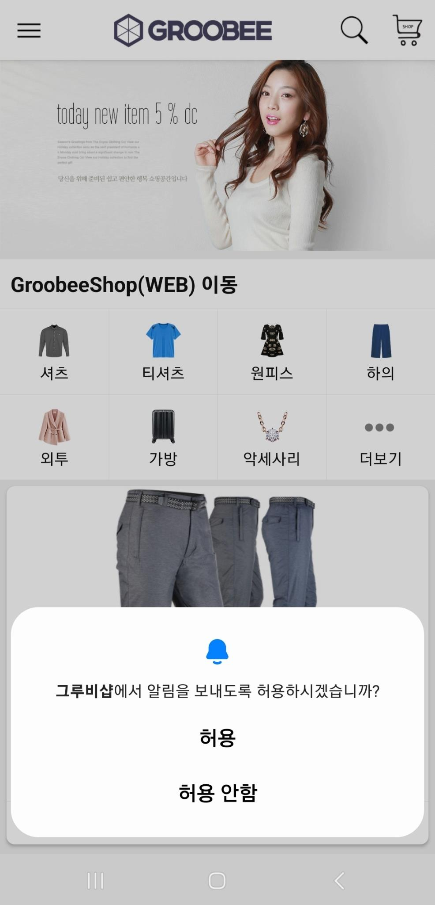

# Android 공통 추가 설정

이 문서는 Android Native SDK와 Flutter Android SDK 공통 기준으로 설치 후 함께 적용해야 하는 Android 플랫폼 설정을 정리한 문서입니다.

포함 내용:

- Android 13 이상 알림 권한
- 잠금 상태 기기에서 FCM 수신
- ProGuard / R8 설정

## Android 13 이상 알림 권한

Android 13(Target SDK 33) 이상에서는 알림 권한이 기본적으로 비활성화되어 있으므로 `POST_NOTIFICATIONS` 권한 선언과 런타임 요청이 필요합니다.

`AndroidManifest.xml`

```xml
<manifest xmlns:android="http://schemas.android.com/apk/res/android">
    <uses-permission android:name="android.permission.POST_NOTIFICATIONS" />

    <application ...>
        ...
    </application>
</manifest>
```

권한 요청 예시:

Kotlin:

```kotlin
if (
    Build.VERSION.SDK_INT >= Build.VERSION_CODES.TIRAMISU &&
    ContextCompat.checkSelfPermission(this, Manifest.permission.POST_NOTIFICATIONS) !=
        PackageManager.PERMISSION_GRANTED
) {
    requestPermissions(
        arrayOf(Manifest.permission.POST_NOTIFICATIONS),
        REQUEST_CODE
    )
}
```

Java:

```java
if (Build.VERSION.SDK_INT >= Build.VERSION_CODES.TIRAMISU
        && ContextCompat.checkSelfPermission(
                this,
                Manifest.permission.POST_NOTIFICATIONS
        ) != PackageManager.PERMISSION_GRANTED) {
    requestPermissions(
            new String[]{Manifest.permission.POST_NOTIFICATIONS},
            REQUEST_CODE
    );
}
```

사용자에게 실제로 노출되는 권한 요청 다이얼로그 예시입니다.



## 잠금 상태 기기에서 Push 수신

기기가 잠금 해제되기 전 직접 부팅 모드에서 FCM을 수신하려면 아래 조건이 필요합니다.

- 기기가 direct boot 모드를 지원해야 합니다. (일반적으로 활성화되어 있습니다.)
- 기기에 Google Play 서비스 `19.0.54` 이상이 설치되어 있어야 합니다.
- 앱에서 `com.google.firebase:firebase-messaging`를 사용해야 합니다.

자세한 조건과 구현 방법은 [FCM Direct Boot 공식 문서](https://firebase.google.com/docs/cloud-messaging/android/receive?hl=ko#receive_fcm_messages_in_direct_boot_mode)를 참고하세요.

추가 의존성:

```kotlin
dependencies {
    implementation("com.google.firebase:firebase-messaging-directboot:20.2.0")
}
```

`firebase-messaging-directboot`는 `minSdk 19` 이상에서 사용할 수 있습니다.

Manifest 예시:

```xml
<application ...>
    <service
        android:name="io.groobee.message.GroobeeFirebaseMessagingService"
        android:directBootAware="true"
        android:exported="true">
        <intent-filter>
            <action android:name="com.google.firebase.MESSAGING_EVENT" />
        </intent-filter>
    </service>
</application>
```

## ProGuard / R8 설정

Groobee SDK 사용 시 아래와 같은 `proguard-rules.pro` 설정 추가를 권장합니다.

```proguard
# Retrofit does reflection on generic parameters. InnerClasses is required to use Signature and
# EnclosingMethod is required to use InnerClasses.
-keepattributes Signature, InnerClasses, EnclosingMethod

# Retrofit does reflection on method and parameter annotations.
-keepattributes RuntimeVisibleAnnotations, RuntimeVisibleParameterAnnotations

# Keep annotation default values (e.g., retrofit2.http.Field.encoded).
-keepattributes AnnotationDefault

# Retain service method parameters when optimizing.
-keepclassmembers,allowshrinking,allowobfuscation interface * {
    @retrofit2.http.* <methods>;
}

# Ignore annotation used for build tooling.
-dontwarn org.codehaus.mojo.animal_sniffer.IgnoreJRERequirement

# Ignore JSR 305 annotations for embedding nullability information.
-dontwarn javax.annotation.**

# Guarded by a NoClassDefFoundError try/catch and only used when on the classpath.
-dontwarn kotlin.Unit

# Top-level functions that can only be used by Kotlin.
-dontwarn retrofit2.KotlinExtensions
-dontwarn retrofit2.KotlinExtensions.*

# With R8 full mode, it sees no subtypes of Retrofit interfaces since they are created with a Proxy
# and replaces all potential values with null. Explicitly keeping the interfaces prevents this.
-if interface * { @retrofit2.http.* <methods>; }
-keep,allowobfuscation interface <1>

# Keep generic signature of Call, Response (R8 full mode strips signatures from non-kept items).
-keep,allowobfuscation,allowshrinking interface retrofit2.Call
-keep,allowobfuscation,allowshrinking class retrofit2.Response

# With R8 full mode generic signatures are stripped for classes that are not
# kept. Suspend functions are wrapped in continuations where the type argument is used.
-keep,allowobfuscation,allowshrinking class kotlin.coroutines.Continuation

##---------------Begin: proguard configuration for Gson ----------
-keepattributes Signature
-keepattributes *Annotation*
-dontwarn sun.misc.**

-keep class com.google.gson.examples.android.model.** { <fields>; }
-keep class * extends com.google.gson.TypeAdapter
-keep class * implements com.google.gson.TypeAdapterFactory
-keep class * implements com.google.gson.JsonSerializer
-keep class * implements com.google.gson.JsonDeserializer

-keepclassmembers,allowobfuscation class * {
    @com.google.gson.annotations.SerializedName <fields>;
}

-keep,allowobfuscation,allowshrinking class com.google.gson.reflect.TypeToken
-keep,allowobfuscation,allowshrinking class * extends com.google.gson.reflect.TypeToken
##---------------End: proguard configuration for Gson ----------

-keep public class * implements com.bumptech.glide.module.GlideModule
-keep class * extends com.bumptech.glide.module.AppGlideModule {
    <init>(...);
}
-keep public enum com.bumptech.glide.load.ImageHeaderParser$** {
    **[] $VALUES;
    public *;
}
-keep class com.bumptech.glide.load.data.ParcelFileDescriptorRewinder$InternalRewinder {
    *** rewind();
}

-keepattributes Signature
-keepattributes Annotation
-keep class okhttp3.** { *; }
-keep interface okhttp3.** { *; }
-dontwarn okhttp3.**
-dontwarn okio.**

-keep class com.tickaroo.tikxml.** { *; }
-keep class **$$TypeAdapter { *; }
-keepclasseswithmembernames class * {
    @com.tickaroo.tikxml.* <fields>;
}
-keepclasseswithmembernames class * {
    @com.tickaroo.tikxml.* <methods>;
}
-keep @com.tickaroo.tikxml.annotation.Xml public class *
```
