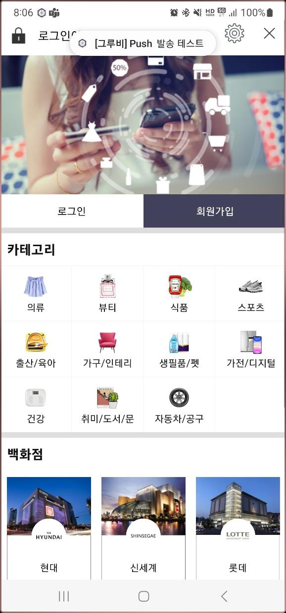

# Groobee Android SDK 설치 가이드 (Native)

이 문서는 Groobee Android Native SDK의 설치 절차만 정리한 문서입니다. 현재 권장 버전은 [Android SDK 변경 로그](../changelog/sdk-android-changelog.md)에서 확인하세요.

캠페인 개요와 기능별 사용 문서는 아래 문서를 참고하세요.

- [Android SDK 개요 및 캠페인](../detail/android-sdk-overview.md)
- [Android SDK 회원 정보 및 푸시 상태 연동](../detail/android-sdk-member-push.md)
- [Android SDK 화면 이벤트 및 행동 이력 연동](../detail/android-sdk-screen-events.md)
- [Android SDK 하이브리드 앱 데이터 동기화](../detail/android-sdk-hybrid-sync.md)
- [Android SDK 추천 상품 연동](../detail/android-sdk-recommend.md)

Flutter 앱(Android 빌드)에서 `MethodChannel`로 연동하는 경우에는 [Android Flutter SDK 설치 가이드](./installation-android-flutter-sdk.md)를 참고하세요.

---

## 목차

1. [설치 전 확인](#sdk-overview)
2. [SDK 설치](#sdk-install)
3. [Application 설정](#application-config)
4. [Push Messaging Service 설정](#push-service)
5. [설치 후 연동 문서](#sdk-methods)
6. [Android 공통 추가 설정](#android-settings)

---

<a id="sdk-overview"></a>
## 설치 전 확인

- Groobee 서비스키
- [앱 정보 등록 (앱 패키지명 / Bundle ID / 플랫폼 정보)](../prerequisites/app-name-registration.md)
- 푸시 사용 시 Firebase 프로젝트 설정과 Firebase 비공개키 업로드

SDK 개요와 캠페인 설명은 [Android SDK 개요 및 캠페인](../detail/android-sdk-overview.md) 문서에 정리했습니다.

---

<a id="sdk-install"></a>
## SDK 설치

### 1. Gradle 저장소 설정

프로젝트에서 `google()`과 `mavenCentral()` 저장소를 사용할 수 있어야 합니다. 프로젝트의 Gradle 구조에 맞춰 아래 중 하나에 두 저장소가 포함되어 있는지 확인하고, 없으면 추가합니다.

Gradle 7.0 이상 / 최신 Android Studio 기본 구조 — `settings.gradle(.kts)`:

```kotlin
dependencyResolutionManagement {
    repositories {
        google()
        mavenCentral()
    }
}
```

구형 프로젝트 구조 — 루트 `build.gradle`:

```gradle
allprojects {
    repositories {
        google()
        mavenCentral()
    }
}
```

> `repositoriesMode`(`FAIL_ON_PROJECT_REPOS` 등) 옵션은 프로젝트의 저장소 관리 정책에 따라 결정되는 설정으로, Groobee SDK 설치와 직접 관련이 없습니다. 기존 프로젝트의 값을 그대로 두고 저장소만 확인하세요.

### 2. 앱 모듈 의존성 추가

```kotlin
dependencies {
    implementation("io.groobee.message:groobee-sdk-message:<version>")
}
```

적용 버전은 [Android SDK 변경 로그](../changelog/sdk-android-changelog.md)에서 최신 안정 버전을 확인한 뒤 설정하세요.

### 3. Gradle Sync 및 빌드 확인

- Gradle Sync가 정상적으로 완료되는지 확인합니다.
- 앱을 한 번 빌드해 의존성 충돌이 없는지 확인합니다.

---

<a id="application-config"></a>
## Application 설정

Groobee 초기화는 `Application.onCreate()`에서 수행하는 것을 권장합니다.

### Kotlin 예시

```kotlin
class MyApplication : Application() {
    override fun onCreate() {
        super.onCreate()

        val groobeeConfig = GroobeeConfig.Builder()
            .setApiKey("발급받은_서비스키")
            .setPushMoveActivityEnabled(true)
            .setPushMoveActivityClassName(MainActivity::class.java)
            .setHandlePushDeepLinks(true)
            .setSmallNotificationIcon(resources.getResourceName(R.drawable.ic_push))
            .setNotificationSettingsButton(
                R.string.txt_notification_setting,
                "myapp://setting/notification"
            )
            .setInAppMsgMarginTop(30)
            .setInAppMsgMarginBottom(40)

        if (Build.VERSION.SDK_INT > Build.VERSION_CODES.N) {
            groobeeConfig.setPushImportance(NotificationManager.IMPORTANCE_HIGH)
        }

        Groobee.configure(this, groobeeConfig.build())
        registerActivityLifecycleCallbacks(Groobee.getInstance().activityLifecycleCallbacks)

        LoggerUtils.setLogLevel(Log.VERBOSE)
        FirebaseApp.initializeApp(this)
    }
}
```

### Java 예시

```java
public class MyApplication extends Application {
    @Override
    public void onCreate() {
        super.onCreate();

        GroobeeConfig.Builder groobeeConfig = new GroobeeConfig.Builder()
                .setApiKey("발급받은_서비스키")
                .setPushMoveActivityEnabled(true)
                .setPushMoveActivityClassName(MainActivity.class)
                .setHandlePushDeepLinks(true)
                .setSmallNotificationIcon(getResources().getResourceName(R.drawable.ic_push))
                .setNotificationSettingsButton(
                        R.string.txt_notification_setting,
                        "myapp://setting/notification"
                )
                .setInAppMsgMarginTop(30)
                .setInAppMsgMarginBottom(40);

        if (Build.VERSION.SDK_INT > Build.VERSION_CODES.N) {
            groobeeConfig.setPushImportance(NotificationManager.IMPORTANCE_HIGH);
        }

        Groobee.configure(this, groobeeConfig.build());
        registerActivityLifecycleCallbacks(Groobee.getInstance().getActivityLifecycleCallbacks());

        LoggerUtils.setLogLevel(Log.VERBOSE);
        FirebaseApp.initializeApp(this);
    }
}
```

### 주요 설정 항목

| 설정 | 필수 여부 | 설명 |
| --- | --- | --- |
| `setApiKey()` | 필수 | Groobee 어드민에서 발급받은 서비스키를 등록합니다. |
| `setSmallNotificationIcon()` | 필수 | 푸시 알림에 사용할 small icon을 등록합니다. |
| `setPushMoveActivityEnabled()` | 선택 | 푸시 클릭 시 특정 액티비티로 이동할지 여부를 설정합니다. |
| `setPushMoveActivityClassName()` | 조건부 필수 | `setPushMoveActivityEnabled(true)`일 때 이동할 액티비티를 지정합니다. |
| `setHandlePushDeepLinks()` | 선택 | 푸시 클릭 시 딥링크 이동을 허용할지 설정합니다. |
| `setInAppMsgMarginTop()` | 선택 | 인앱메시지 상단 여백을 설정합니다. |
| `setInAppMsgMarginBottom()` | 선택 | 인앱메시지 하단 여백을 설정합니다. |
| `setPushImportance()` | 선택 | 푸시 메시지 중요도를 설정합니다. |
| `setRetryAuthConnection()` | 선택 | Groobee 인증 실패 시 재인증 여부를 설정합니다. |
| `setNotificationSettingsButton()` | 선택 | 푸시 알림 하단에 수신 설정 버튼을 추가합니다. 문자열 리소스와 설정 화면 딥링크가 필요합니다. |
| `Groobee.configure()` | 필수 | 구성한 `GroobeeConfig`를 앱 컨텍스트에 적용합니다. |
| `registerActivityLifecycleCallbacks()` | 필수 | 앱 생명주기에 맞춰 Groobee 세션을 처리합니다. |
| `LoggerUtils.setLogLevel()` | 선택 | 로그 레벨을 설정합니다. |
| `LoggerUtils.setOptions()` | 선택 | 상세 로그, 트레이스, 로그 콜백 등 추가 로그 옵션을 설정합니다. |
| `FirebaseApp.initializeApp()` | 푸시 사용 시 필수 | FCM 연동을 초기화합니다. |

`setNotificationSettingsButton()`에 전달하는 첫 번째 값은 문자열 리소스 ID입니다. 실제 버튼에는 `groobee_noti_config` 같은 리소스 키가 아니라 현재 언어 설정에 맞는 문자열이 노출되어야 합니다.

### 푸시 중요도 설정

Groobee SDK 1.0.44 버전부터 지원되며, Android 공식 문서 기준으로 작성되어 있습니다.

| 값 | 설명 |
| --- | --- |
| `NotificationManager.IMPORTANCE_DEFAULT` | 기본값입니다. 알림이 일반 우선순위로 표시되고 소리/진동이 발생합니다. |
| `NotificationManager.IMPORTANCE_HIGH` | 높은 우선순위로 표시되며, 푸시 수신 시 Toast 노출도 지원합니다. |

> Android 공식 문서에는 `IMPORTANCE_LOW`, `IMPORTANCE_MIN`도 존재하지만, 그루비 푸시 메시지 지원 기능 특성상 부적합하다고 판단되어 `IMPORTANCE_DEFAULT`보다 낮은 값은 적용되지 않습니다.
> `setPushImportance()`를 호출하지 않으면 `IMPORTANCE_DEFAULT`가 기본값으로 적용됩니다.

`IMPORTANCE_HIGH` 설정 시에는 아래와 같이 푸시 수신 순간 상단에 Toast 메시지가 함께 노출됩니다.



---

<a id="push-service"></a>
## Push Messaging Service 설정

### 기본 서비스 등록

```xml
<application
    android:name=".MyApplication"
    ...>

    <service
        android:name="io.groobee.message.GroobeeFirebaseMessagingService"
        android:exported="false">
        <intent-filter>
            <action android:name="com.google.firebase.MESSAGING_EVENT" />
        </intent-filter>
    </service>
</application>
```

> 일반 FCM 서비스 등록 시에는 Android 최신 보안 관행에 맞춰 `exported="false"`를 권장합니다. 잠금 상태(Direct Boot) 기기에서도 푸시를 수신해야 하는 경우에는 [Android 공통 추가 설정](./installation-android-common-settings.md)에서 `exported="true"`와 `directBootAware="true"`를 함께 설정하는 별도 예시를 참고하세요.

### 기존 FirebaseMessagingService를 이미 사용 중인 경우

Kotlin:

```kotlin
class CustomService : FirebaseMessagingService() {
    override fun onMessageReceived(remoteMessage: RemoteMessage) {
        super.onMessageReceived(remoteMessage)

        if (GroobeeFirebaseMessagingService.handleRemoteMessage(this, remoteMessage)) {
            return
        }

        remoteMessage.notification?.let {
            Log.d("CustomService", "Message Notification Body: ${it.body}")
        }
    }
}
```

Java:

```java
public class CustomService extends FirebaseMessagingService {
    @Override
    public void onMessageReceived(@NonNull RemoteMessage remoteMessage) {
        super.onMessageReceived(remoteMessage);

        if (GroobeeFirebaseMessagingService.handleRemoteMessage(this, remoteMessage)) {
            return;
        }

        if (remoteMessage.getNotification() != null) {
            Log.d("CustomService", "Message Notification Body: "
                    + remoteMessage.getNotification().getBody());
        }
    }
}
```

> 기존에 등록된 FCM 서비스가 있다면 하나의 엔트리만 남기고 정리하세요.

---

<a id="sdk-methods"></a>
## 설치 후 연동 문서

<a id="member-push-methods"></a>
### 회원 정보 및 푸시 상태

- [Android SDK 회원 정보 및 푸시 상태 연동](../detail/android-sdk-member-push.md)

<a id="screen-methods"></a>
### 화면 이벤트 및 행동 이력

- [Android SDK 화면 이벤트 및 행동 이력 연동](../detail/android-sdk-screen-events.md)

<a id="hybrid-methods"></a>
### 하이브리드 앱 데이터 동기화

- [Android SDK 하이브리드 앱 데이터 동기화](../detail/android-sdk-hybrid-sync.md)

<a id="recommend-methods"></a>
### 추천 상품 연동

- [Android SDK 추천 상품 연동](../detail/android-sdk-recommend.md)

---

<a id="android-settings"></a>
## Android 공통 추가 설정

- [Android 공통 추가 설정](./installation-android-common-settings.md)
