# Groobee iOS SDK 설치 가이드 (Flutter)

이 문서는 Flutter 앱(iOS 빌드)에 Groobee iOS SDK를 연동하는 설치 절차를 정리한 문서입니다. 현재 권장 버전은 [iOS SDK 변경 로그](../changelog/sdk-ios-changelog.md)에서 확인하세요.

캠페인 개요와 기능별 사용 문서는 아래 문서를 참고하세요.

- [iOS SDK 개요 및 지원 범위](../detail/ios-sdk-overview.md)
- [iOS SDK 회원 정보 및 푸시 상태 연동](../detail/ios-sdk-member-push.md)
- [iOS SDK 행동 이력 수집](../detail/ios-sdk-actions.md)
- [iOS SDK 하이브리드 앱 데이터 동기화](../detail/ios-sdk-hybrid-sync.md)
- [iOS SDK 추천 상품 연동](../detail/ios-sdk-recommend.md)
- [iOS SDK 주의사항 및 로그 유틸리티](../detail/ios-sdk-cautions-log.md)
- [Flutter iOS SDK MethodChannel 연동](../detail/ios-flutter-method-channel.md)

---

## 목차

1. [설치 전 확인](#flutter-install)
2. [SDK 설치](#sdk-install)
3. [4단계: AppDelegate 설정](#appdelegate-config)
4. [5단계: LifeCycle 설정](#lifecycle-config)
5. [6단계: Push Messaging Service 설정](#push-service)
6. [7단계: Service 와 Content Extension 추가 (Rich Push)](#rich-push)
7. [Flutter 브리지 구현 문서](#method-channel)
8. [설치 후 연동 문서](#sdk-methods)

---

<a id="flutter-install"></a>
## 설치 전 확인

- Groobee 서비스키
- [앱 정보 등록 (앱 패키지명 / Bundle ID / 플랫폼 정보)](../prerequisites/app-name-registration.md)
- 푸시 사용 시 Firebase 프로젝트 설정과 Firebase 비공개키 업로드
- APNS 인증 키(`.p8`), Key ID, Team ID
- Xcode에서 Push Notifications, Background Modes 활성화
- Flutter 프로젝트에서 iOS 모듈(`ios/`)을 수정할 수 있는 환경 (Xcode, CocoaPods)
- `ios/Runner/GoogleService-Info.plist` 파일 준비

---

<a id="sdk-install"></a>
## SDK 설치

### 1단계: `pubspec.yaml`에 Firebase 패키지 추가

Flutter 프로젝트 하위의 `pubspec.yaml`에 Firebase 관련 패키지를 추가합니다. 이미 추가되어 있다면 이 단계는 생략합니다.

```yaml
dependencies:
  flutter:
    sdk: flutter
  # The following adds the Cupertino Icons font to your application.
  # Use with the CupertinoIcons class for iOS style icons.
  cupertino_icons: ^1.0.2

  firebase_messaging: ^14.1.0
  firebase_core: ^2.7.0
  firebase_core_platform_interface: ^4.5.3
```

위 예시는 `firebase_messaging: ^14.1.0`, `firebase_core: ^2.7.0`, `firebase_core_platform_interface: ^4.5.3` 조합을 기준으로 작성되었습니다. 실제 적용 시에는 현재 사용하는 Flutter SDK 및 Firebase 구성과 호환되는 버전을 사용하세요.

### 2단계: GroobeeKit Podfile 작성

Flutter iOS 앱 프로젝트 폴더(`ios/`)에 생성되어 있는 `Podfile`에 아래와 같이 `GroobeeKit`을 추가합니다.

```ruby
pod 'GroobeeKit'
```

> Native iOS에서는 `FirebaseFirestore`, `FirebaseMessaging`을 별도로 추가하지만, Flutter iOS에서는 `pod 'GroobeeKit'` 단독으로만 추가합니다. Firebase 관련 의존성은 Flutter 측 `firebase_messaging`, `firebase_core` 패키지가 iOS에 플러그인 형태로 주입합니다.

### 3단계: GroobeeKit Pod install

터미널에서 `GroobeeKit`을 적용할 Flutter iOS 앱 프로젝트 경로로 이동한 뒤 `flutter pub get`을 실행하고, `ios/` 경로로 이동해 `pod install`을 실행합니다.

```bash
flutter pub get
pod install
```

> `flutter pub get` 이후 Flutter 플러그인이 Podfile에 `firebase_core`, `firebase_messaging` 관련 의존성을 주입하므로, 반드시 `flutter pub get` → `pod install` 순서로 실행해야 합니다.

---

<a id="appdelegate-config"></a>
## 4단계: AppDelegate 설정

### import 및 상속 설정

Swift (`AppDelegate.swift`):

```swift
import UIKit
import Flutter
import Firebase
import GroobeeKit
import UserNotifications
import AppTrackingTransparency
import AdSupport

@UIApplicationMain
@objc class AppDelegate: FlutterAppDelegate {
    ...
}
```

Objective-C (`AppDelegate.m`):

```objectivec
#import "AppDelegate.h"
#import "GeneratedPluginRegistrant.h"
#import <GroobeeKit/GroobeeKit-Swift.h>

@import Firebase;
@import FirebaseMessaging;
@import UserNotifications;

@interface AppDelegate () <UNUserNotificationCenterDelegate, FIRMessagingDelegate>

@end

@implementation AppDelegate

...
```

> Flutter iOS 앱은 `FlutterAppDelegate`를 상속받아야 하며, `@UIApplicationMain` 어노테이션과 `GeneratedPluginRegistrant`를 통한 Flutter 플러그인 등록이 필수입니다.

### AppDelegate에 설정할 Groobee 기능별 정리

| 클래스 | 메소드 | 설명 |
| --- | --- | --- |
| `GroobeeConfig` | `setServiceKey` | (필수) Groobee 어드민에서 발급받은 서비스키 등록. |
| `GroobeeConfig` | `setInAppMsgMarginTop` | (선택) 인앱메시지 상단 노출일 경우 마진값 설정. |
| `GroobeeConfig` | `setInAppMsgMarginBottom` | (선택) 인앱메시지 하단 노출일 경우 마진값 설정. |
| `GroobeeConfig` | `setNotificationSettingsButton` | (선택) 푸시 알림 하단에 수신 설정 버튼 추가. 버튼 텍스트는 `NSLocalizedString`으로 다국어화된 텍스트를 권장하며, 앱에 알림 수신 설정 페이지 딥링크 처리가 추가로 필요합니다. |
| `Groobee` | `configure` | (필수) 설정한 `GroobeeConfig`와 AppContext 전달. |
| `FirebaseApp` | `initializeApp` | (필수) FCM 활용을 위한 Firebase 연동. |
| `Messaging` | `messaging().delegate` | (필수) FCM 활용을 위한 Firebase Messaging 연동. |

### Swift 예시

`AppDelegate.swift`의 `application(_:didFinishLaunchingWithOptions:)` 메소드에 다음 코드를 추가합니다.

```swift
func application(
    _ application: UIApplication,
    didFinishLaunchingWithOptions launchOptions: [UIApplication.LaunchOptionsKey: Any]?
) -> Bool {
    GeneratedPluginRegistrant.register(with: self)

    let serviceKey = "서비스키"
    let bundleID = Bundle.main.bundleIdentifier!

    let groobeeConfig = GroobeeConfig.GroobeeConfigBuilder()
        .setServiceKey(serviceKey: serviceKey, bundleId: bundleID)
        .setInAppMsgMarginTop(50)
        .setInAppMsgMarginBottom(17)
        .setNotificationSettingsButton("알림설정", "myapp://set/noti")
        .build()
    Groobee.configure(groobeeConfig: groobeeConfig)

    pushNotiConfirmation()
    return super.application(application, didFinishLaunchingWithOptions: launchOptions)
}

func pushNotiConfirmation() {
    let center = UNUserNotificationCenter.current()
    center.requestAuthorization(options: [.badge, .alert, .sound], completionHandler: { granted, error in
        if granted {
            print("Notifications permission granted.")
            DispatchQueue.main.async {
                UIApplication.shared.registerForRemoteNotifications()
            }
        } else {
            print("Notifications permission denied.")
        }
    })
    center.delegate = self
}
```

> Flutter 앱은 일반적으로 Firebase 초기화를 Dart 측(`Firebase.initializeApp()`)에서 먼저 수행합니다. 한편 위 설정표에는 `FirebaseApp.initializeApp`이 필수로 표기되어 있으므로, 프로젝트의 Firebase 초기화 방식과 SDK 요구사항을 확인한 뒤 AppDelegate에도 필요 시 `FirebaseApp.configure()`와 `Messaging.messaging().delegate = self`를 추가하세요.

### Objective-C 예시

`AppDelegate.m`의 `application:didFinishLaunchingWithOptions:` 메소드에 다음 코드를 추가합니다.

```objectivec
- (BOOL)application:(UIApplication *)application didFinishLaunchingWithOptions:(NSDictionary *)launchOptions {
    NSString *bundleId = [[NSBundle mainBundle] bundleIdentifier];
    NSString *serviceKey = @"서비스키";

    GroobeeConfig *groobeeConfig = [[[[[[GroobeeConfigBuilder alloc] init]
        setServiceKeyWithServiceKey:serviceKey bundleId:bundleId]
        setNotificationSettingsButton:@"알림설정" deeplink:@"myapp://set/noti"]
        setInAppMsgMarginTop:17]
        setInAppMsgMarginBottom:50]
        build];

    [Groobee configureWithGroobeeConfig:groobeeConfig];

    [FIRApp configure];
    [FIRMessaging messaging].delegate = self;
    [self pushNotiConfirmation];
    [application registerForRemoteNotifications];

    return YES;
}

- (void)pushNotiConfirmation {
    if ([UNUserNotificationCenter class] != nil) {
        [UNUserNotificationCenter currentNotificationCenter].delegate = self;
        UNAuthorizationOptions authOptions = UNAuthorizationOptionAlert | UNAuthorizationOptionSound | UNAuthorizationOptionBadge;

        [[UNUserNotificationCenter currentNotificationCenter]
            requestAuthorizationWithOptions:authOptions
            completionHandler:^(BOOL granted, NSError * _Nullable error) {
        }];
    }
}
```

---

<a id="lifecycle-config"></a>
## 5단계: LifeCycle 설정

Groobee의 세션과 메시지 처리를 위해 App의 LifeCycle을 `GroobeeKitLifeCycle`에 연결합니다.

### iOS 13 미만

Swift (`AppDelegate.swift`):

```swift
func applicationWillResignActive(_ application: UIApplication) {
    GroobeeKitLifeCycle.sceneWillResignActive()
}

func applicationDidEnterBackground(_ application: UIApplication) {
    GroobeeKitLifeCycle.sceneDidEnterBackground()
}

func applicationWillEnterForeground(_ application: UIApplication) {
    GroobeeKitLifeCycle.sceneWillEnterForeground()
}

func applicationDidBecomeActive(_ application: UIApplication) {
    GroobeeKitLifeCycle.sceneDidBecomeActive()
}

func applicationWillTerminate(_ application: UIApplication) {
    GroobeeKitLifeCycle.sceneDidDisconnect()
}
```

Objective-C (`AppDelegate.m`):

```objectivec
- (void)applicationWillResignActive:(UIApplication *)application {
    [GroobeeKitLifeCycle sceneWillResignActive];
}

- (void)applicationDidEnterBackground:(UIApplication *)application {
    [GroobeeKitLifeCycle sceneDidEnterBackground];
}

- (void)applicationWillEnterForeground:(UIApplication *)application {
    [GroobeeKitLifeCycle sceneWillEnterForeground];
}

- (void)applicationDidBecomeActive:(UIApplication *)application {
    [GroobeeKitLifeCycle sceneDidBecomeActive];
}

- (void)applicationWillTerminate:(UIApplication *)application {
    [GroobeeKitLifeCycle sceneDidDisconnect];
}
```

### iOS 13 이상

Swift (`SceneDelegate.swift`):

```swift
func sceneDidDisconnect(_ scene: UIScene) {
    GroobeeKitLifeCycle.sceneDidDisconnect()
}

func sceneDidBecomeActive(_ scene: UIScene) {
    GroobeeKitLifeCycle.sceneDidBecomeActive()
}

func sceneWillResignActive(_ scene: UIScene) {
    GroobeeKitLifeCycle.sceneWillResignActive()
}

func sceneWillEnterForeground(_ scene: UIScene) {
    GroobeeKitLifeCycle.sceneWillEnterForeground()
}

func sceneDidEnterBackground(_ scene: UIScene) {
    GroobeeKitLifeCycle.sceneDidEnterBackground()
}
```

Swift (`AppDelegate.swift`):

```swift
func application(
    _ application: UIApplication,
    didDiscardSceneSessions sceneSessions: Set<UISceneSession>
) {
    GroobeeKitLifeCycle.sceneDidDisconnect()
}
```

Objective-C (`SceneDelegate.m`):

```objectivec
- (void)sceneDidDisconnect:(UIScene *)scene {
    [GroobeeKitLifeCycle sceneDidDisconnect];
}

- (void)sceneDidBecomeActive:(UIScene *)scene {
    [GroobeeKitLifeCycle sceneDidBecomeActive];
}

- (void)sceneWillResignActive:(UIScene *)scene {
    [GroobeeKitLifeCycle sceneWillResignActive];
}

- (void)sceneWillEnterForeground:(UIScene *)scene {
    [GroobeeKitLifeCycle sceneWillEnterForeground];
}

- (void)sceneDidEnterBackground:(UIScene *)scene {
    [GroobeeKitLifeCycle sceneDidEnterBackground];
}
```

Objective-C (`AppDelegate.m`):

```objectivec
- (void)application:(UIApplication *)application
didDiscardSceneSessions:(NSSet<UISceneSession *> *)sceneSessions {
    [GroobeeKitLifeCycle sceneDidDisconnect];
}
```

---

<a id="push-service"></a>
## 6단계: Push Messaging Service 설정

### FCM과 APNS 연동 방법
iOS의 경우 APNs 인증키를 FCM에 등록해야 FCM을 통한 푸시 발송이 가능합니다.  \
다음은 APNs 인증키를 FCM에 등록하는 방법예시입니다.

1. Firebase 콘솔에서 `설정` > `일반` > `클라우드 메시징` 메뉴로 진입한 후, 등록해둔 앱의 APN 인증키를 업로드 버튼을 누릅니다.

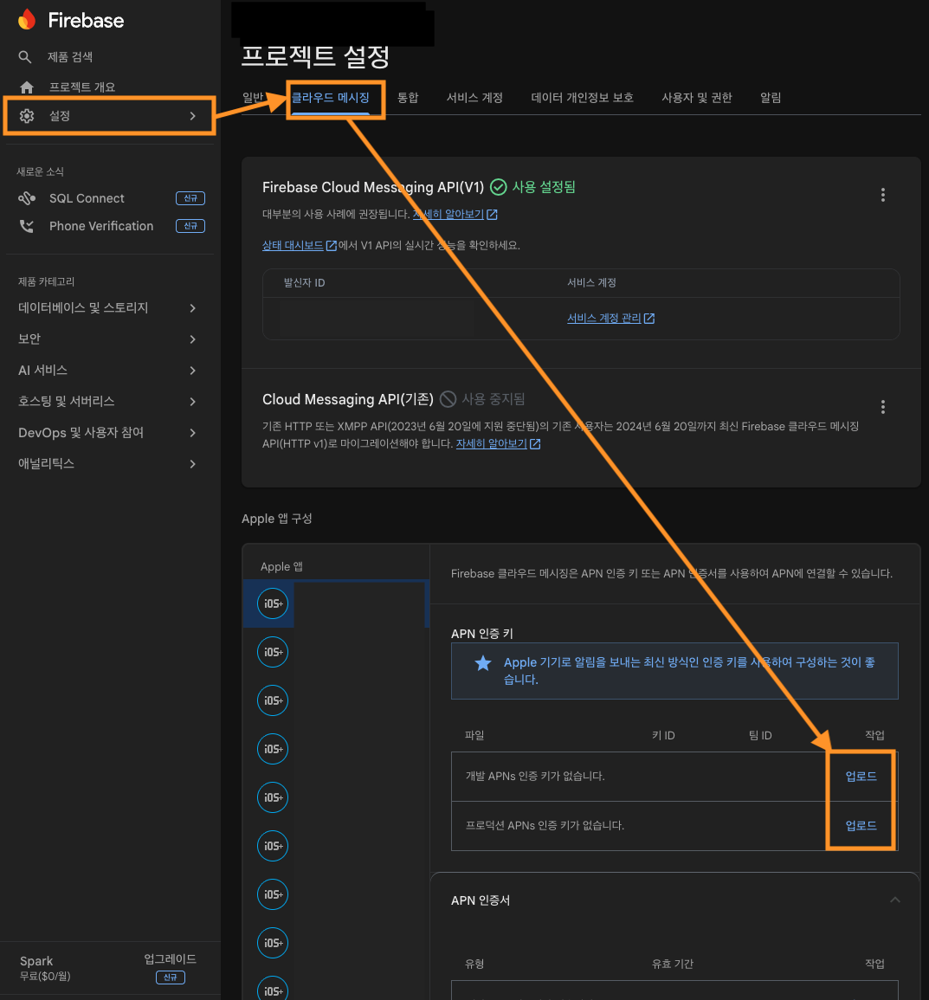

2. 내려받은 `.p8` 파일을 업로드하고 Key ID, Team ID를 입력해 업로드를 완료합니다.

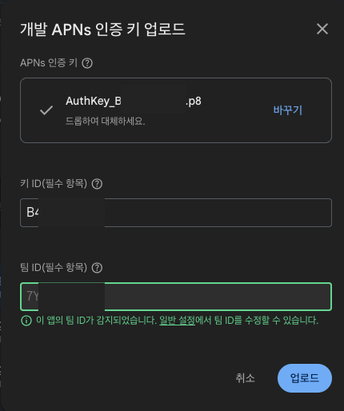

3. 업로드가 완료되면 APNs 인증키가 등록된 것을 확인할 수 있습니다.

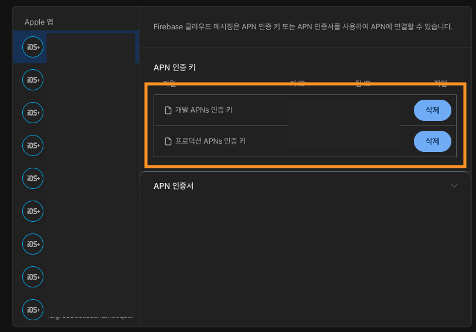

참고 링크:

- APNS 연동 공식 문서: [Firebase Cloud Messaging for iOS](https://firebase.google.com/docs/cloud-messaging/ios/client?hl=ko)
- Apple Auth Key 관리: [Apple Developer Auth Keys](https://developer.apple.com/account/resources/authkeys/list)
- Apple Team 정보: [Apple Developer Account](https://developer.apple.com/account)

---

<a id="rich-push"></a>
## 7단계: Service 와 Content Extension 추가 (Rich Push)

Service와 Content를 추가한 Rich Push 방식을 사용하면 푸시 메시지 전환 상태 측정과 커스텀 푸시 메시지 확장이 가능합니다. Notification Service Extension, Notification Content Extension을 추가하고 가이드에 맞춰 진행해 주세요.

### Notification Service Extension

사용자에게 전달되기 전 Remote Notification의 내용을 수정하는 확장입니다. 이미지, 비디오, 오디오, 특수 형식 콘텐츠를 알림에 추가할 수 있습니다.

`Notification Service Extension`을 사용하지 않을 경우 iOS 단말기에서는 이미지를 Push Message에 등록할 수 없는 문제가 발생할 수 있습니다.

Apple 공식 문서: <https://developer.apple.com/documentation/usernotifications/unnotificationserviceextension>

### Notification Content Extension

앱의 알림에 대한 사용자 지정 인터페이스를 표시하는 확장입니다. 사용자 지정 색상, 브랜딩, 미디어, 동적 콘텐츠를 알림 인터페이스에 통합할 수 있습니다.

Apple 공식 문서: <https://developer.apple.com/documentation/usernotificationsui/unnotificationcontentextension>

### Service 설정

1. `+ Capabilities` 버튼을 눌러 `Push Notifications`와 `Background Modes`를 추가하고 `Background fetch`, `Remote notifications`를 체크하여 활성화합니다.

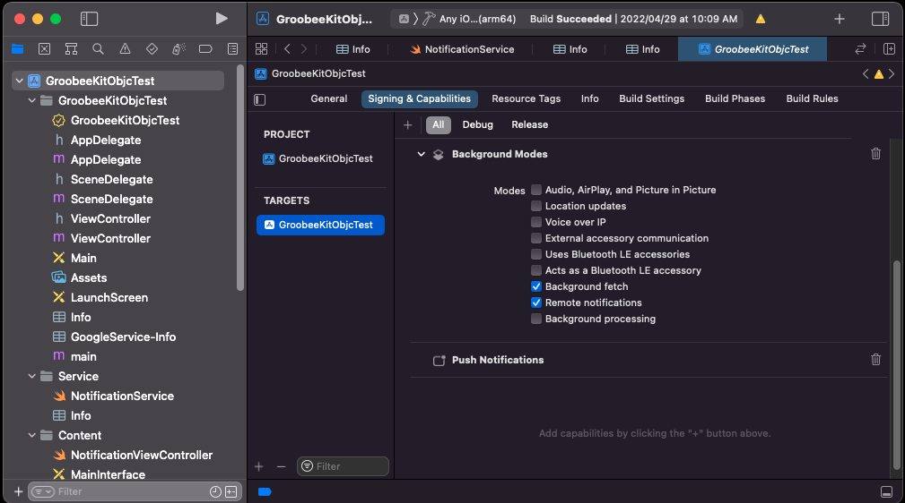

2. `TARGETS` 하단의 `+` 버튼을 클릭합니다.

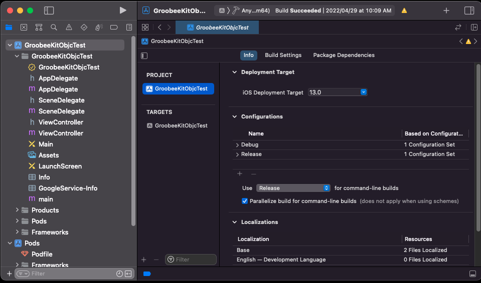

3. `Notification` 검색 후 `Notification Service Extension`을 선택하여 `Next`로 진행합니다.

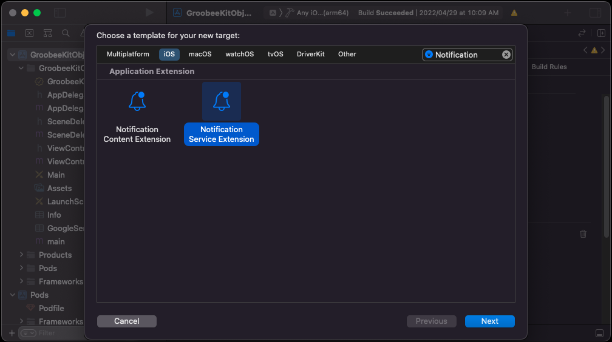

4. `Product Name`을 `Service`로 입력하고 `Language`를 `Swift`로 설정한 뒤 `Finish`를 클릭하고, 다이얼로그에서 `Activate`를 눌러 Service 스키마를 활성화합니다.

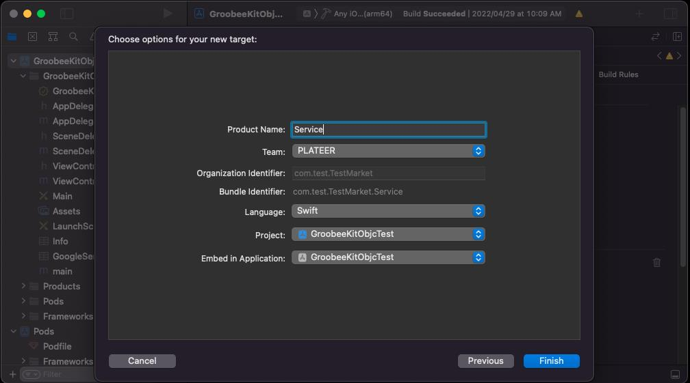

5. Service의 `Deployment Info`에서 iOS 버전을 현재 앱 프로젝트의 Deployment Target과 동일하게 설정합니다. 그리고 `Frameworks and Libraries`에 `GroobeeKit.xcframework`를 추가하고 `Embed`를 `Do Not Embed`로 설정합니다.

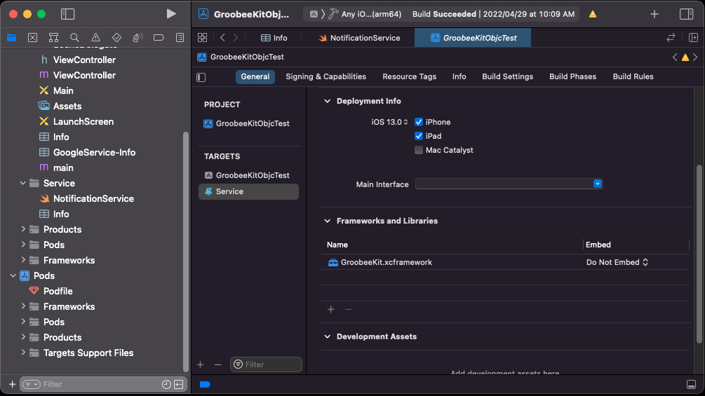

6. `Service -> Info.plist`에 아래 항목을 추가합니다.

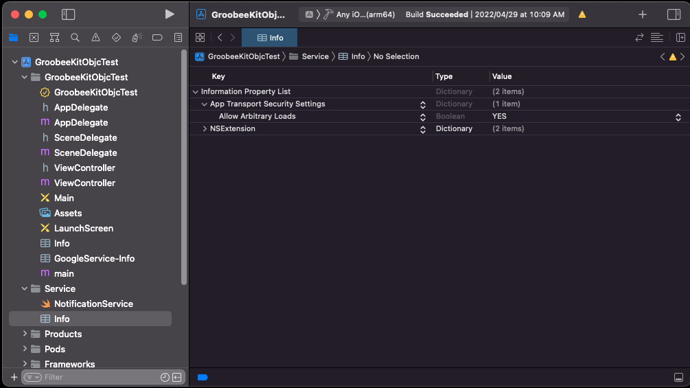

| Key | Type | Value |
| --- | --- | --- |
| `App Transport Security Settings` | Dictionary | `(1 item)` |
| `Allow Arbitrary Loads` | Boolean | `YES` |

7. `NotificationService.swift`에 아래 코드를 작성합니다.

Firebase 메시징 서비스가 이미 등록되어 있는 경우 `GroobeeNotification.getInstance().receiveService()`를 통해 `request`, `bestAttemptContent`, `contentHandler` 객체를 Groobee에 전달할 수 있습니다.

또한, Groobee는 Admin에서 발송한 메시지만 렌더링할 수 있도록 분기 처리 로직이 포함되어 있습니다. 다른 FCM 서비스를 이용 중인 경우에는 `else` 구간에 코드를 삽입해 메시징 핸들링을 제어할 수 있습니다.

```swift
import UserNotifications
import Foundation
import GroobeeKit

class NotificationService: UNNotificationServiceExtension {
    var contentHandler: ((UNNotificationContent) -> Void)?
    var bestAttemptContent: UNMutableNotificationContent?

    override func didReceive(
        _ request: UNNotificationRequest,
        withContentHandler contentHandler: @escaping (UNNotificationContent) -> Void
    ) {
        self.contentHandler = contentHandler
        bestAttemptContent = (request.content.mutableCopy() as? UNMutableNotificationContent)

        if let bestAttemptContent = bestAttemptContent {
            if GroobeeNotification.getInstance().receiveService(
                request,
                bestAttemptContent,
                withContentHandler: contentHandler
            ) {
                // Groobee Push Message
            } else {
                // Check if message contains a notification payload.
            }
        }
    }

    override func serviceExtensionTimeWillExpire() {
        if let contentHandler = contentHandler, let bestAttemptContent = bestAttemptContent {
            contentHandler(bestAttemptContent)
        }
    }
}
```

### Content 설정

1. `TARGETS` 하단의 `+` 버튼을 클릭합니다.

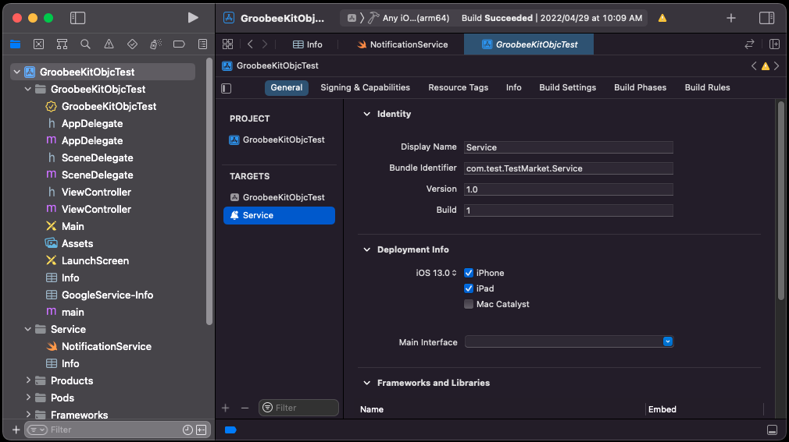

2. `Notification` 검색 후 `Notification Content Extension`을 선택하여 `Next`로 진행합니다.

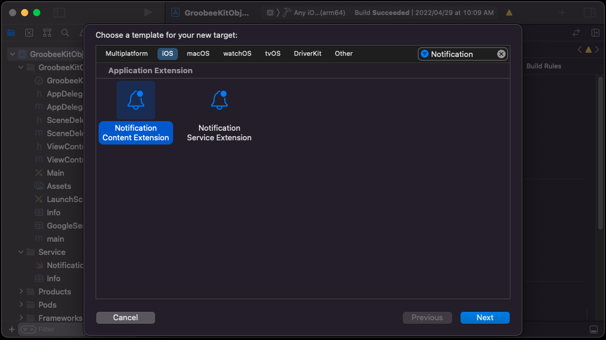

3. `Product Name`을 `Content`로 입력하고 `Language`를 `Swift`로 설정한 뒤 `Finish`를 클릭하고, 다이얼로그에서 `Activate`를 눌러 Content 스키마를 활성화합니다.

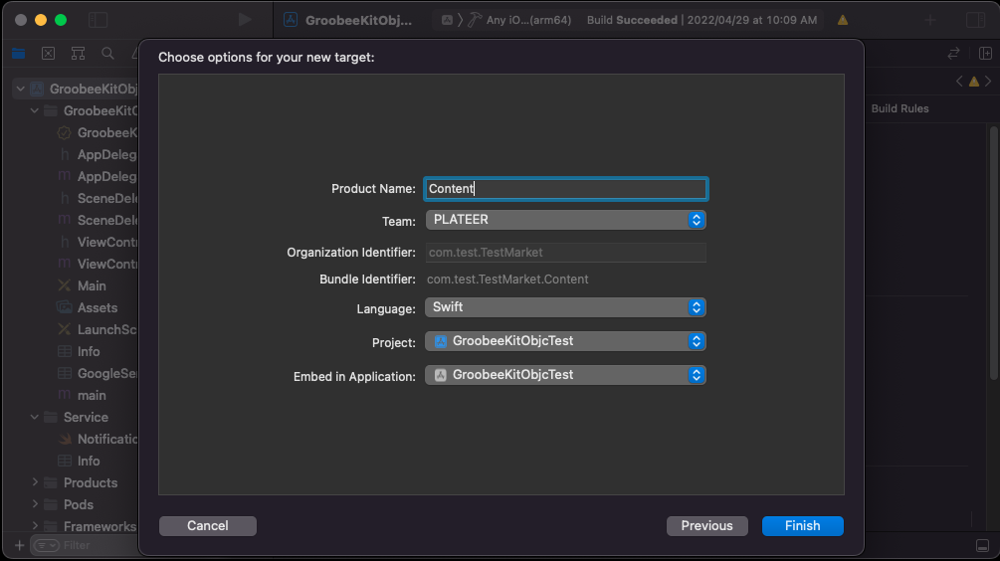

4. Content의 `Deployment Info`에서 iOS 버전을 현재 앱 프로젝트의 Deployment Target과 동일하게 설정합니다. 그리고 `Frameworks and Libraries`에 `GroobeeKit.xcframework`를 추가하고 `Embed`를 `Do Not Embed`로 설정합니다.

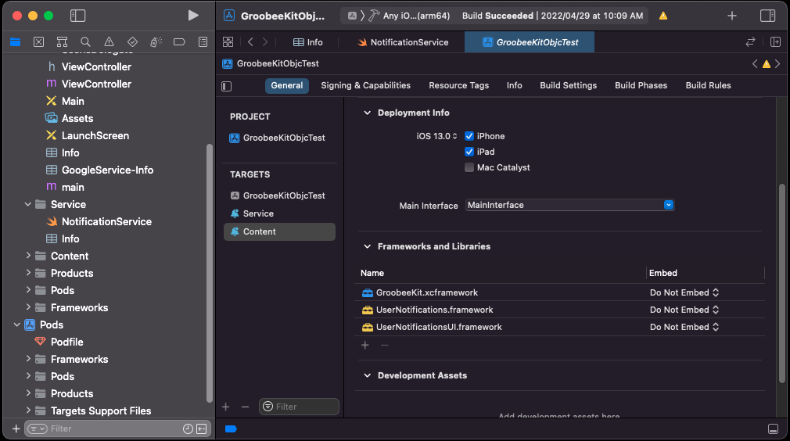

5. `Content -> Info.plist`에 아래 항목을 추가합니다.

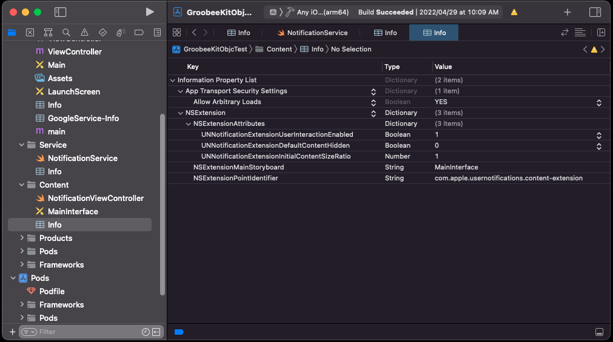

| Key | Type | Value |
| --- | --- | --- |
| `App Transport Security Settings` | Dictionary | `(1 item)` |
| `Allow Arbitrary Loads` | Boolean | `YES` |

| Key | Type | Value |
| --- | --- | --- |
| `NSExtensionAttributes` | Dictionary | `(3 items)` |
| `UNNotificationExtensionUserInteractionEnabled` | Boolean | `1` |
| `UNNotificationExtensionDefaultContentHidden` | Boolean | `0` |
| `UNNotificationExtensionInitialContentSizeRatio` | Number | `1` |

6. `NotificationViewController.swift`에 아래 코드를 작성합니다.

Firebase 메시징 서비스가 이미 등록되어 있는 경우 `GroobeeNotification.getInstance().receiveContent()`를 통해 `notification` 객체를 Groobee에 전달할 수 있습니다.

`NotificationService.swift`에 추가한 분기 로직과 동일하게 Content에도 분기 코드를 작성합니다.

```swift
import UIKit
import UserNotifications
import UserNotificationsUI
import Foundation
import GroobeeKit

class NotificationViewController: UIViewController, UNNotificationContentExtension {
    @IBOutlet var label: UILabel?

    func didReceive(_ notification: UNNotification) {
        if GroobeeNotification.getInstance().receiveContent(notification) {
            // Groobee Push Message
        } else {
            // Check if message contains a notification payload.
        }
    }

    func didReceive(
        _ response: UNNotificationResponse,
        completionHandler completion: @escaping (UNNotificationContentExtensionResponseOption) -> Void
    ) {
        completion(.doNotDismiss)
    }
}
```

> Rich Push의 상세 Xcode 설정 화면과 스크린샷은 [iOS Native SDK 설치 가이드](./installation-ios-sdk.md)의 **Rich Push 설정** 섹션과 동일합니다. Flutter 프로젝트에서도 `Runner` 프로젝트에 Extension을 추가하는 절차 자체는 Native iOS와 동일하게 적용됩니다.

---

<a id="method-channel"></a>
## Flutter 브리지 구현 문서

Flutter 앱에서는 Dart 측 코드에서 Groobee SDK 메소드를 직접 호출할 수 없기 때문에, `MethodChannel`을 이용해 Dart ↔ iOS 사이를 연결해야 합니다.

- [Flutter iOS SDK MethodChannel 연동](../detail/ios-flutter-method-channel.md)

Dart 측에서는 FCM 토큰 생성 전에 `Firebase.initializeApp()`을 먼저 호출해야 합니다. (주의: 프로젝트 하위에 `GoogleService-Info.plist`가 포함되어 있어야 합니다.)

```dart
Future<void> initializeDefault() async {
  await Firebase.initializeApp();
  getFcmToken();
}
```

---

<a id="sdk-methods"></a>
## 설치 후 연동 문서

### 개요 및 지원 범위

- [iOS SDK 개요 및 지원 범위](../detail/ios-sdk-overview.md)

### 회원 정보 및 푸시 상태

- [iOS SDK 회원 정보 및 푸시 상태 연동](../detail/ios-sdk-member-push.md)

### 행동 이력 수집

- [iOS SDK 행동 이력 수집](../detail/ios-sdk-actions.md)

### 하이브리드 앱 데이터 동기화

- [iOS SDK 하이브리드 앱 데이터 동기화](../detail/ios-sdk-hybrid-sync.md)

### 추천 상품 연동

- [iOS SDK 추천 상품 연동](../detail/ios-sdk-recommend.md)

### 주의사항 및 로그 유틸리티

- [iOS SDK 주의사항 및 로그 유틸리티](../detail/ios-sdk-cautions-log.md)

### Flutter 브리지 구현

- [Flutter iOS SDK MethodChannel 연동](../detail/ios-flutter-method-channel.md)
