# Groobee iOS SDK 설치 가이드 (Flutter)

이 문서는 Flutter 앱(iOS 빌드)에 Groobee iOS SDK를 연동하는 설치 절차를 정리한 문서입니다. 현재 권장 버전은 [iOS SDK 변경 로그](../changelog/sdk-ios-changelog.md)에서 확인하세요.

캠페인 개요와 기능별 사용 문서는 아래 문서를 참고하세요.

- [iOS SDK 개요 및 지원 범위](../detail/ios-sdk-overview.md)
- [iOS SDK 회원 정보 및 푸시 상태 연동](../detail/ios-sdk-member-push.md)
- [iOS SDK 행동 이력 수집](../detail/ios-sdk-actions.md)
- [iOS SDK 하이브리드 앱 데이터 동기화](../detail/ios-sdk-hybrid-sync.md)
- [iOS SDK 추천 상품 연동](../detail/ios-sdk-recommend.md)
- [iOS SDK 주의사항 및 로그 유틸리티](../detail/ios-sdk-cautions-log.md)
- [Flutter iOS SDK MethodChannel 연동](../detail/ios-flutter-method-channel.md)

---

## 목차

1. [설치 전 확인](#flutter-install)
2. [SDK 설치](#sdk-install)
3. [4단계: AppDelegate 설정](#appdelegate-config)
4. [5단계: LifeCycle 설정](#lifecycle-config)
5. [6단계: Push Messaging Service 설정](#push-service)
6. [7단계: Service 와 Content Extension 추가 (Rich Push, 선택)](#rich-push)
7. [Flutter 브리지 구현 문서](#method-channel)
8. [설치 후 연동 문서](#sdk-methods)

---

<a id="flutter-install"></a>
## 설치 전 확인

- Groobee 서비스키
- [앱 정보 등록 (앱 패키지명 / Bundle ID / 플랫폼 정보)](../prerequisites/app-name-registration.md)
- 푸시 사용 시 Firebase 프로젝트 설정과 Firebase 비공개키 업로드 — 어드민 등록 방법은 [어드민 푸시 설정 가이드](https://docs.groobee.ai/new-admin/settings/push)를 참고하세요.
- APNS 인증 키(`.p8`), Key ID, Team ID
- Xcode에서 Push Notifications, Background Modes 활성화
- Flutter 프로젝트에서 iOS 모듈(`ios/`)을 수정할 수 있는 환경 (Xcode, CocoaPods)
- `ios/Runner/GoogleService-Info.plist` 파일 준비

---

<a id="sdk-install"></a>
## SDK 설치

### 1단계: `pubspec.yaml`에 Firebase 패키지 추가

Flutter 프로젝트 하위의 `pubspec.yaml`에 Firebase 관련 패키지를 추가합니다. 이미 추가되어 있다면 이 단계는 생략합니다.

```yaml
dependencies:
  flutter:
    sdk: flutter

  firebase_core:
  firebase_messaging:
```

이미 Firebase 관련 패키지를 사용 중인 프로젝트라면 기존 설정을 유지해도 됩니다.

### 2단계: GroobeeKit Podfile 작성

Flutter iOS 앱 프로젝트 폴더(`ios/`)에 생성되어 있는 `Podfile`에 아래와 같이 `GroobeeKit`을 추가합니다.

```ruby
pod 'GroobeeKit'
```

> Native iOS에서는 `FirebaseFirestore`, `FirebaseMessaging`을 별도로 추가하지만, Flutter iOS에서는 `pod 'GroobeeKit'` 단독으로만 추가합니다. Firebase 관련 의존성은 Flutter 측 `firebase_messaging`, `firebase_core` 패키지가 iOS에 플러그인 형태로 주입합니다.

### 3단계: GroobeeKit Pod install

터미널에서 `GroobeeKit`을 적용할 Flutter iOS 앱 프로젝트 경로로 이동한 뒤 `flutter pub get`을 실행하고, `ios/` 경로로 이동해 `pod install`을 실행합니다.

```bash
flutter pub get
pod install
```

> `flutter pub get` 이후 Flutter 플러그인이 Podfile에 `firebase_core`, `firebase_messaging` 관련 의존성을 주입하므로, 반드시 `flutter pub get` → `pod install` 순서로 실행해야 합니다.

---

<a id="appdelegate-config"></a>
## 4단계: AppDelegate 설정

### import 및 상속 설정

Swift (`AppDelegate.swift`):

```swift
import UIKit
import Flutter
import FirebaseCore
import FirebaseMessaging
import GroobeeKit
import UserNotifications
import AppTrackingTransparency
import AdSupport

@main
@objc class AppDelegate: FlutterAppDelegate {
    ...
}
```

Objective-C (`AppDelegate.m`):

```objectivec
#import "AppDelegate.h"
#import "GeneratedPluginRegistrant.h"
#import <GroobeeKit/GroobeeKit-Swift.h>

@import UserNotifications;

@interface AppDelegate () <UNUserNotificationCenterDelegate>

@end

@implementation AppDelegate

...
```

> Flutter iOS 앱은 `FlutterAppDelegate`를 상속받아야 하며, 기존 프로젝트에서 이미 생성된 `AppDelegate` 구조가 있다면 해당 구조를 유지한 상태로 Groobee 설정만 추가하세요.

### AppDelegate에 설정할 Groobee 기능별 정리

| 클래스 | 메소드 | 설명 |
| --- | --- | --- |
| `GroobeeConfig` | `setServiceKey` | (필수) 그루비 어드민에서 발급받은 서비스키 등록. |
| `GroobeeConfig` | `setInAppMsgMarginTop` | (선택) 인앱메시지 상단 노출일 경우 마진값 설정. |
| `GroobeeConfig` | `setInAppMsgMarginBottom` | (선택) 인앱메시지 하단 노출일 경우 마진값 설정. |
| `GroobeeConfig` | `setNotificationSettingsButton` | (선택) 푸시 알림 하단에 수신 설정 버튼 추가. 버튼 텍스트는 `NSLocalizedString`으로 다국어화된 텍스트를 권장하며, 앱에 알림 수신 설정 페이지 딥링크 처리가 추가로 필요합니다. |
| `Groobee` | `configure` | (필수) 설정한 `GroobeeConfig`를 SDK에 적용. |
| `Firebase` | `Firebase.initializeApp()` 또는 `FirebaseApp.configure()` | (푸시 사용 시 필수) FCM 토큰 발급 전에 Firebase 초기화. Flutter에서는 일반적으로 Dart 측에서 처리합니다. |
| `Messaging` | `Messaging.messaging().delegate` | (선택) FCM 토큰을 AppDelegate에서 직접 수신할 때 설정. Dart에서 `firebase_messaging`으로 토큰을 받아 `setPushToken`으로 전달하는 구조라면 생략할 수 있습니다. |

### Swift 예시

`AppDelegate.swift`의 `application(_:didFinishLaunchingWithOptions:)` 메소드에 다음 코드를 추가합니다.

아래 예시는 Groobee SDK 초기화와 iOS 푸시 권한 요청만 포함합니다. Flutter 앱에서 FCM 토큰은 보통 Dart 측 `firebase_messaging`에서 발급받아 MethodChannel로 `Groobee.getInstance().setPushToken(pushToken:)`에 전달합니다.

```swift
func application(
    _ application: UIApplication,
    didFinishLaunchingWithOptions launchOptions: [UIApplication.LaunchOptionsKey: Any]?
) -> Bool {
    GeneratedPluginRegistrant.register(with: self)

    let serviceKey = "서비스키"
    let bundleID = Bundle.main.bundleIdentifier!

    let groobeeConfig = GroobeeConfig.GroobeeConfigBuilder()
        .setServiceKey(serviceKey: serviceKey, bundleId: bundleID)
        .setInAppMsgMarginTop(50)
        .setInAppMsgMarginBottom(17)
        .setNotificationSettingsButton("알림설정", "myapp://set/noti")
        .build()
    Groobee.configure(groobeeConfig: groobeeConfig)

    pushNotiConfirmation()
    return super.application(application, didFinishLaunchingWithOptions: launchOptions)
}

func pushNotiConfirmation() {
    let center = UNUserNotificationCenter.current()
    center.requestAuthorization(options: [.badge, .alert, .sound], completionHandler: { granted, error in
        if granted {
            print("Notifications permission granted.")
            DispatchQueue.main.async {
                UIApplication.shared.registerForRemoteNotifications()
            }
        } else {
            print("Notifications permission denied.")
        }
    })
    center.delegate = self
}
```

> FCM 토큰을 AppDelegate의 `MessagingDelegate`에서 직접 수신하는 구조라면 기존 Firebase 초기화 정책에 맞춰 `FirebaseApp.configure()`와 `Messaging.messaging().delegate = self`를 추가하세요. Firebase 초기화는 앱에서 한 번만 수행되어야 합니다.

### Objective-C 예시

`AppDelegate.m`의 `application:didFinishLaunchingWithOptions:` 메소드에 다음 코드를 추가합니다.

Objective-C 예시도 Groobee SDK 초기화와 iOS 푸시 권한 요청만 포함합니다. FCM 토큰을 AppDelegate에서 직접 수신하는 구조라면 기존 Firebase 초기화 정책에 맞춰 Firebase 초기화와 `FIRMessagingDelegate` 설정을 추가하세요.

```objectivec
- (BOOL)application:(UIApplication *)application didFinishLaunchingWithOptions:(NSDictionary *)launchOptions {
    NSString *bundleId = [[NSBundle mainBundle] bundleIdentifier];
    NSString *serviceKey = @"서비스키";

    GroobeeConfig *groobeeConfig = [[[[[[GroobeeConfigBuilder alloc] init]
        setServiceKeyWithServiceKey:serviceKey bundleId:bundleId]
        setNotificationSettingsButton:@"알림설정" deeplink:@"myapp://set/noti"]
        setInAppMsgMarginTop:17]
        setInAppMsgMarginBottom:50]
        build];

    [Groobee configureWithGroobeeConfig:groobeeConfig];

    [self pushNotiConfirmation];

    return YES;
}

- (void)pushNotiConfirmation {
    if ([UNUserNotificationCenter class] != nil) {
        [UNUserNotificationCenter currentNotificationCenter].delegate = self;
        UNAuthorizationOptions authOptions = UNAuthorizationOptionAlert | UNAuthorizationOptionSound | UNAuthorizationOptionBadge;

        [[UNUserNotificationCenter currentNotificationCenter]
            requestAuthorizationWithOptions:authOptions
            completionHandler:^(BOOL granted, NSError * _Nullable error) {
                if (granted) {
                    dispatch_async(dispatch_get_main_queue(), ^{
                        [UIApplication.sharedApplication registerForRemoteNotifications];
                    });
                }
        }];
    }
}
```

---

<a id="lifecycle-config"></a>
## 5단계: LifeCycle 설정

그루비의 세션과 메시지 처리를 위해 App의 LifeCycle을 `GroobeeKitLifeCycle`에 연결합니다.

### iOS 13 미만

Swift (`AppDelegate.swift`):

```swift
func applicationWillResignActive(_ application: UIApplication) {
    GroobeeKitLifeCycle.sceneWillResignActive()
}

func applicationDidEnterBackground(_ application: UIApplication) {
    GroobeeKitLifeCycle.sceneDidEnterBackground()
}

func applicationWillEnterForeground(_ application: UIApplication) {
    GroobeeKitLifeCycle.sceneWillEnterForeground()
}

func applicationDidBecomeActive(_ application: UIApplication) {
    GroobeeKitLifeCycle.sceneDidBecomeActive()
}

func applicationWillTerminate(_ application: UIApplication) {
    GroobeeKitLifeCycle.sceneDidDisconnect()
}
```

Objective-C (`AppDelegate.m`):

```objectivec
- (void)applicationWillResignActive:(UIApplication *)application {
    [GroobeeKitLifeCycle sceneWillResignActive];
}

- (void)applicationDidEnterBackground:(UIApplication *)application {
    [GroobeeKitLifeCycle sceneDidEnterBackground];
}

- (void)applicationWillEnterForeground:(UIApplication *)application {
    [GroobeeKitLifeCycle sceneWillEnterForeground];
}

- (void)applicationDidBecomeActive:(UIApplication *)application {
    [GroobeeKitLifeCycle sceneDidBecomeActive];
}

- (void)applicationWillTerminate:(UIApplication *)application {
    [GroobeeKitLifeCycle sceneDidDisconnect];
}
```

### iOS 13 이상

Swift (`SceneDelegate.swift`):

```swift
func sceneDidDisconnect(_ scene: UIScene) {
    GroobeeKitLifeCycle.sceneDidDisconnect()
}

func sceneDidBecomeActive(_ scene: UIScene) {
    GroobeeKitLifeCycle.sceneDidBecomeActive()
}

func sceneWillResignActive(_ scene: UIScene) {
    GroobeeKitLifeCycle.sceneWillResignActive()
}

func sceneWillEnterForeground(_ scene: UIScene) {
    GroobeeKitLifeCycle.sceneWillEnterForeground()
}

func sceneDidEnterBackground(_ scene: UIScene) {
    GroobeeKitLifeCycle.sceneDidEnterBackground()
}
```

Swift (`AppDelegate.swift`):

```swift
func application(
    _ application: UIApplication,
    didDiscardSceneSessions sceneSessions: Set<UISceneSession>
) {
    GroobeeKitLifeCycle.sceneDidDisconnect()
}
```

Objective-C (`SceneDelegate.m`):

```objectivec
- (void)sceneDidDisconnect:(UIScene *)scene {
    [GroobeeKitLifeCycle sceneDidDisconnect];
}

- (void)sceneDidBecomeActive:(UIScene *)scene {
    [GroobeeKitLifeCycle sceneDidBecomeActive];
}

- (void)sceneWillResignActive:(UIScene *)scene {
    [GroobeeKitLifeCycle sceneWillResignActive];
}

- (void)sceneWillEnterForeground:(UIScene *)scene {
    [GroobeeKitLifeCycle sceneWillEnterForeground];
}

- (void)sceneDidEnterBackground:(UIScene *)scene {
    [GroobeeKitLifeCycle sceneDidEnterBackground];
}
```

Objective-C (`AppDelegate.m`):

```objectivec
- (void)application:(UIApplication *)application
didDiscardSceneSessions:(NSSet<UISceneSession *> *)sceneSessions {
    [GroobeeKitLifeCycle sceneDidDisconnect];
}
```

---

<a id="push-service"></a>
## 6단계: Push Messaging Service 설정

### FCM과 APNS 연동 방법
iOS의 경우 APNs 인증키를 FCM에 등록해야 FCM을 통한 푸시 발송이 가능합니다.  \
다음은 APNs 인증키를 FCM에 등록하는 방법예시입니다.

1. Firebase 콘솔에서 `설정` > `일반` > `클라우드 메시징` 메뉴로 진입한 후, 등록해둔 앱의 APN 인증키를 업로드 버튼을 누릅니다.

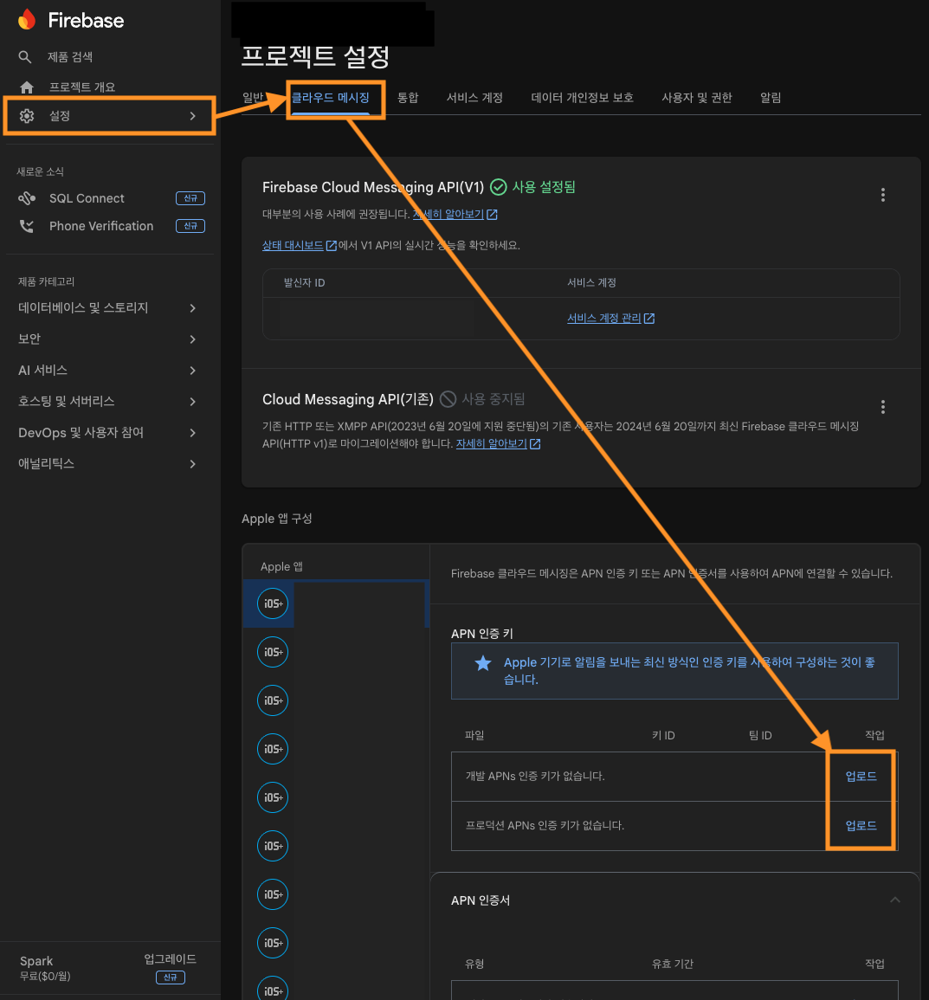

2. 내려받은 `.p8` 파일을 업로드하고 Key ID, Team ID를 입력해 업로드를 완료합니다.

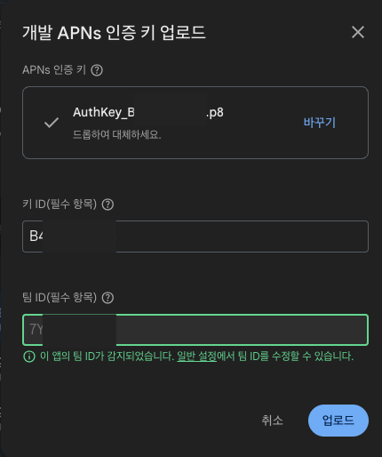

3. 업로드가 완료되면 APNs 인증키가 등록된 것을 확인할 수 있습니다.

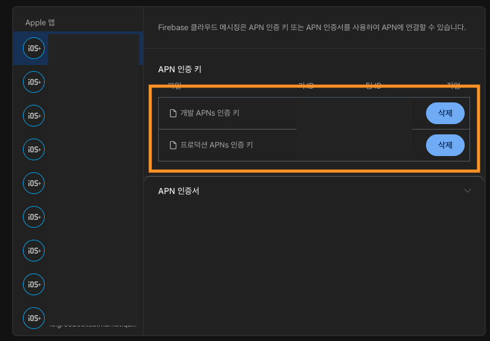

참고 링크:

- APNS 연동 공식 문서: [Firebase Cloud Messaging for iOS](https://firebase.google.com/docs/cloud-messaging/ios/client?hl=ko)
- Apple Auth Key 관리: [Apple Developer Auth Keys](https://developer.apple.com/account/resources/authkeys/list)
- Apple Team 정보: [Apple Developer Account](https://developer.apple.com/account)

### Runner 타겟 Push Capability 확인

Flutter iOS 프로젝트에서 실제 APNs/FCM 푸시를 사용하려면 Runner 타겟에 푸시 권한과 백그라운드 수신 설정이 포함되어 있어야 합니다.

1. `ios/Runner.xcworkspace`를 Xcode로 엽니다.
2. `Runner` 타겟의 **Signing & Capabilities** 탭으로 이동합니다.
3. `+ Capability`를 눌러 **Push Notifications**를 추가합니다.
4. **Background Modes**를 추가하고 **Remote notifications**를 체크합니다.

Xcode에서 `Push Notifications`를 추가하면 `Runner.entitlements`에 `aps-environment` 항목이 포함됩니다. 이 설정이 없으면 APNs 토큰이 발급되지 않고, 결과적으로 FCM 토큰 및 Groobee 푸시 발송 대상 등록도 정상 처리되지 않습니다.

### Flutter AppDelegate 푸시 수신 및 응답 처리

Flutter 앱에서 `firebase_messaging` 등 다른 Flutter 플러그인과 Groobee SDK를 함께 사용하는 경우, iOS 푸시 수신/응답 콜백을 Groobee SDK와 Flutter 플러그인 양쪽에 전달해야 합니다.

알림 응답 처리는 `Groobee.getInstance().userNotificationCenter(response:)`에서 처리합니다. 이 메소드는 Groobee 푸시의 알림 본문 탭과 알림 설정 버튼 액션을 처리합니다. `GroobeeNotification.getInstance().receiveService()`는 아래 Rich Push 섹션의 `Notification Service Extension`에서 알림 표시 전 내용을 가공할 때 사용하는 메소드이며, 알림 응답 처리용이 아닙니다.

Swift:

```swift
override func application(
    _ application: UIApplication,
    didRegisterForRemoteNotificationsWithDeviceToken deviceToken: Data
) {
    let isFirebaseProxyDisabled =
        (Bundle.main.object(forInfoDictionaryKey: "FirebaseAppDelegateProxyEnabled") as? Bool) == false

    if isFirebaseProxyDisabled, FirebaseApp.app() != nil {
        Messaging.messaging().apnsToken = deviceToken
    }

    super.application(
        application,
        didRegisterForRemoteNotificationsWithDeviceToken: deviceToken
    )
}

override func application(
    _ application: UIApplication,
    didReceiveRemoteNotification userInfo: [AnyHashable: Any],
    fetchCompletionHandler completionHandler: @escaping (UIBackgroundFetchResult) -> Void
) {
    Groobee.getInstance().didReceiveRemoteNotification(userInfo: userInfo)

    let isFirebaseProxyDisabled =
        (Bundle.main.object(forInfoDictionaryKey: "FirebaseAppDelegateProxyEnabled") as? Bool) == false

    if isFirebaseProxyDisabled, FirebaseApp.app() != nil {
        Messaging.messaging().appDidReceiveMessage(userInfo)
    }

    super.application(
        application,
        didReceiveRemoteNotification: userInfo,
        fetchCompletionHandler: completionHandler
    )
}

override func userNotificationCenter(
    _ center: UNUserNotificationCenter,
    willPresent notification: UNNotification,
    withCompletionHandler completionHandler: @escaping (UNNotificationPresentationOptions) -> Void
) {
    if #available(iOS 14.0, *) {
        completionHandler([.banner, .list, .badge, .sound])
    } else {
        completionHandler([.alert, .badge, .sound])
    }
}

override func userNotificationCenter(
    _ center: UNUserNotificationCenter,
    didReceive response: UNNotificationResponse,
    withCompletionHandler completionHandler: @escaping () -> Void
) {
    if Groobee.getInstance().userNotificationCenter(response: response) {
        completionHandler()
        return
    }

    super.userNotificationCenter(
        center,
        didReceive: response,
        withCompletionHandler: completionHandler
    )
}
```

`FirebaseAppDelegateProxyEnabled`를 `false`로 둔 프로젝트는 APNs 토큰과 메시지 수신 이벤트를 Firebase Messaging에 수동 전달해야 합니다. 기본값(`true` 또는 키 없음)에서는 Firebase swizzling이 처리하므로 위 조건처럼 중복 호출을 피하세요.

`didReceiveRemoteNotification`에서 `super.application(...)`을 호출하면 Flutter 플러그인 쪽으로도 푸시 이벤트가 전달됩니다. 이 경우 `completionHandler`는 중복 호출하지 않도록 주의하세요.

메소드별 역할은 다음과 같습니다.

| 위치 | 메소드 | 역할 |
| --- | --- | --- |
| `AppDelegate` | `Groobee.getInstance().didReceiveRemoteNotification(userInfo:)` | 푸시 수신 이벤트를 Groobee에 전달합니다. |
| `AppDelegate` | `Groobee.getInstance().userNotificationCenter(response:)` | 알림 본문 탭과 알림 설정 버튼 액션 등 Groobee 푸시 응답을 처리합니다. |
| `Notification Service Extension` | `GroobeeNotification.getInstance().receiveService(...)` | Rich Push 이미지 첨부, 알림 카테고리 설정 등 표시 전 가공을 처리합니다. |
| `Notification Content Extension` | `GroobeeNotification.getInstance().receiveContent(...)` | 커스텀 알림 UI 표시를 처리합니다. |

---

<a id="rich-push"></a>
## 7단계: Service 와 Content Extension 추가 (Rich Push, 선택)

Service와 Content Extension은 기본 푸시 수신, 푸시 오픈/응답 처리, 푸시 토큰 등록에는 필수가 아닙니다.

일반 텍스트 푸시 수신과 푸시 본문 탭 응답 처리는 위 AppDelegate 연동만으로 처리할 수 있습니다. 알림 설정 버튼 액션 응답도 `userNotificationCenter(response:)`에서 처리하지만, 버튼을 실제 알림에 표시하려면 알림 카테고리가 적용되어야 합니다. `Notification Service Extension`을 추가하면 `receiveService()`가 알림 표시 전에 카테고리와 첨부 파일을 가공합니다.

Service와 Content를 추가한 Rich Push 방식을 사용하면 푸시 메시지 전환 상태 측정과 커스텀 푸시 메시지 확장이 가능합니다.

### Notification Service Extension

사용자에게 전달되기 전 Remote Notification의 내용을 수정하는 확장입니다. 이미지, 비디오, 오디오, 특수 형식 콘텐츠를 알림에 추가할 수 있습니다.

`Notification Service Extension`은 이미지 첨부나 알림 표시 전 가공이 필요한 경우에만 추가합니다. 사용하지 않으면 일반 텍스트 푸시 수신/응답 처리는 가능하지만, 이미지가 포함된 Rich Push나 알림 표시 전 카테고리 설정은 처리되지 않습니다.

Apple 공식 문서: <https://developer.apple.com/documentation/usernotifications/unnotificationserviceextension>

### Notification Content Extension

앱의 알림에 대한 사용자 지정 인터페이스를 표시하는 확장입니다. 사용자 지정 색상, 브랜딩, 미디어, 동적 콘텐츠를 알림 인터페이스에 통합할 수 있습니다.

`Notification Content Extension`은 커스텀 알림 UI가 필요한 경우에만 추가합니다.

Apple 공식 문서: <https://developer.apple.com/documentation/usernotificationsui/unnotificationcontentextension>

### Flutter 프로젝트 Podfile 설정

Flutter iOS 프로젝트에서 Notification Service Extension 또는 Notification Content Extension을 추가한 경우, Extension 타겟에서도 `GroobeeKit`을 참조할 수 있어야 합니다. `ios/Podfile`에 Extension 타겟 이름에 맞춰 아래와 같이 추가한 뒤 `pod install`을 다시 실행하세요.

```ruby
target 'Service' do
  use_frameworks!
  pod 'GroobeeKit'
end

target 'Content' do
  use_frameworks!
  pod 'GroobeeKit'
end
```

`Service`, `Content`는 아래 단계에서 생성하는 Extension의 `Product Name` 예시입니다. 실제 프로젝트에서 다른 이름으로 생성했다면 Podfile의 target 이름도 동일하게 맞춰야 합니다.

Xcode가 Extension 타겟을 생성할 때 메인 앱 타겟의 **Build Phases > Embed App Extensions**에 Extension을 자동으로 추가합니다. 빌드 또는 실행 시 Rich Push Extension이 동작하지 않으면 이 항목이 누락되지 않았는지 함께 확인하세요.

### Service 설정

1. `+ Capabilities` 버튼을 눌러 `Push Notifications`와 `Background Modes`를 추가하고 `Background fetch`, `Remote notifications`를 체크하여 활성화합니다.

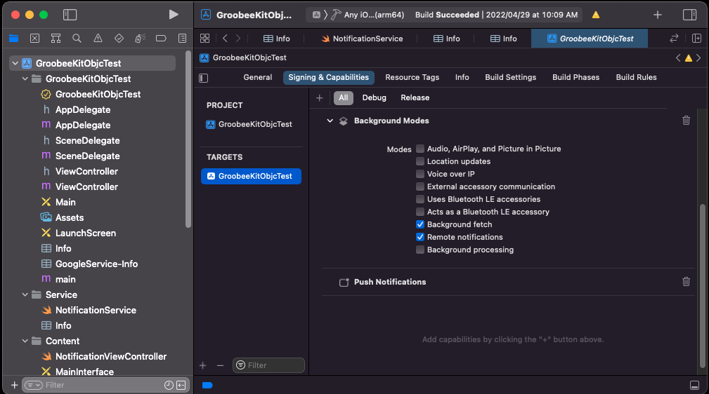

2. `TARGETS` 하단의 `+` 버튼을 클릭합니다.

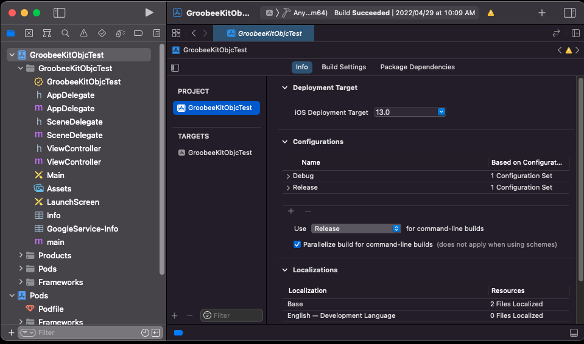

3. `Notification` 검색 후 `Notification Service Extension`을 선택하여 `Next`로 진행합니다.

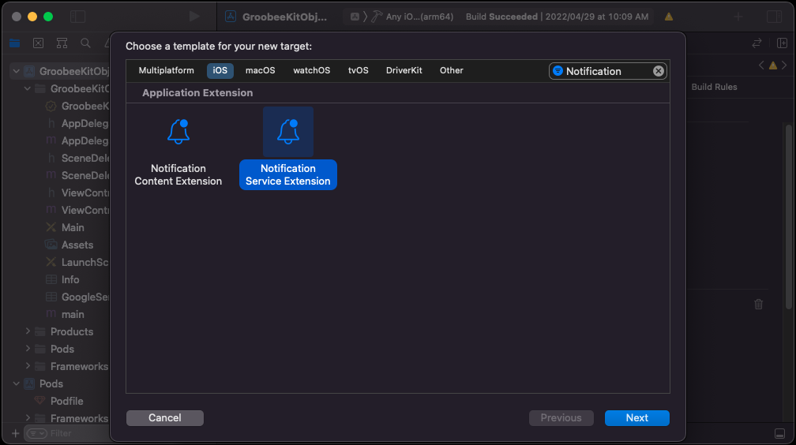

4. `Product Name`을 `Service`로 입력하고 `Language`를 `Swift`로 설정한 뒤 `Finish`를 클릭하고, 다이얼로그에서 `Activate`를 눌러 Service 스키마를 활성화합니다.

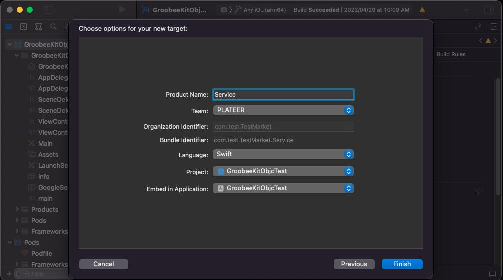

5. Service의 `Deployment Info`에서 iOS 버전을 현재 앱 프로젝트의 Deployment Target과 동일하게 설정합니다. 그리고 `Frameworks and Libraries`에 `GroobeeKit.xcframework`를 추가하고 `Embed`를 `Do Not Embed`로 설정합니다.

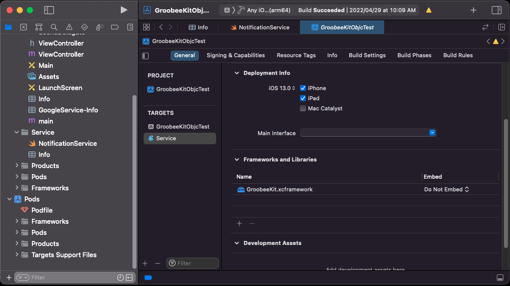

6. `Service -> Info.plist`에 아래 항목을 추가합니다.

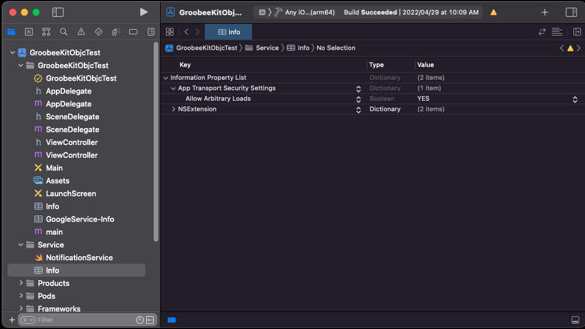

| Key | Type | Value |
| --- | --- | --- |
| `App Transport Security Settings` | Dictionary | `(1 item)` |
| `Allow Arbitrary Loads` | Boolean | `YES` |

7. `NotificationService.swift`에 아래 코드를 작성합니다.

Firebase 메시징 서비스가 이미 등록되어 있는 경우 `GroobeeNotification.getInstance().receiveService()`를 통해 `request`, `bestAttemptContent`, `contentHandler` 객체를 그루비에 전달할 수 있습니다.

또한, 그루비는 Admin에서 발송한 메시지만 렌더링할 수 있도록 분기 처리 로직이 포함되어 있습니다. 다른 FCM 서비스를 이용 중인 경우에는 `else` 구간에 코드를 삽입해 메시징 핸들링을 제어할 수 있습니다.

```swift
import UserNotifications
import Foundation
import GroobeeKit

class NotificationService: UNNotificationServiceExtension {
    var contentHandler: ((UNNotificationContent) -> Void)?
    var bestAttemptContent: UNMutableNotificationContent?

    override func didReceive(
        _ request: UNNotificationRequest,
        withContentHandler contentHandler: @escaping (UNNotificationContent) -> Void
    ) {
        self.contentHandler = contentHandler
        bestAttemptContent = (request.content.mutableCopy() as? UNMutableNotificationContent)

        if let bestAttemptContent = bestAttemptContent {
            if GroobeeNotification.getInstance().receiveService(
                request,
                bestAttemptContent,
                withContentHandler: contentHandler
            ) {
                // Groobee Push Message
            } else {
                // Check if message contains a notification payload.
            }
        }
    }

    override func serviceExtensionTimeWillExpire() {
        if let contentHandler = contentHandler, let bestAttemptContent = bestAttemptContent {
            contentHandler(bestAttemptContent)
        }
    }
}
```

### Content 설정

1. `TARGETS` 하단의 `+` 버튼을 클릭합니다.

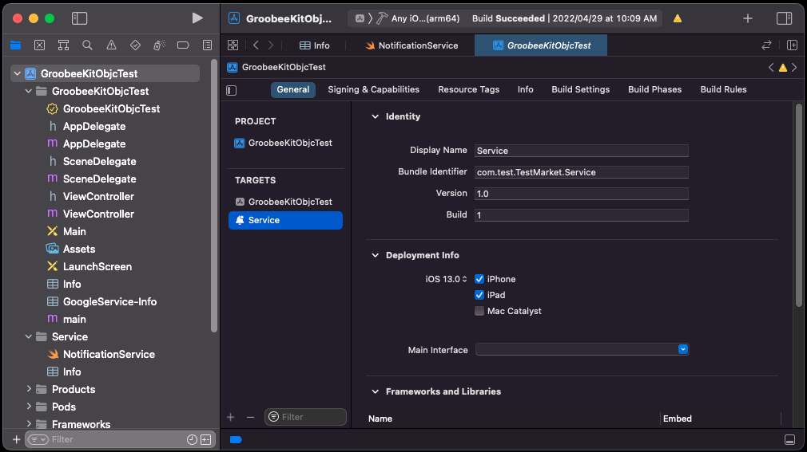

2. `Notification` 검색 후 `Notification Content Extension`을 선택하여 `Next`로 진행합니다.

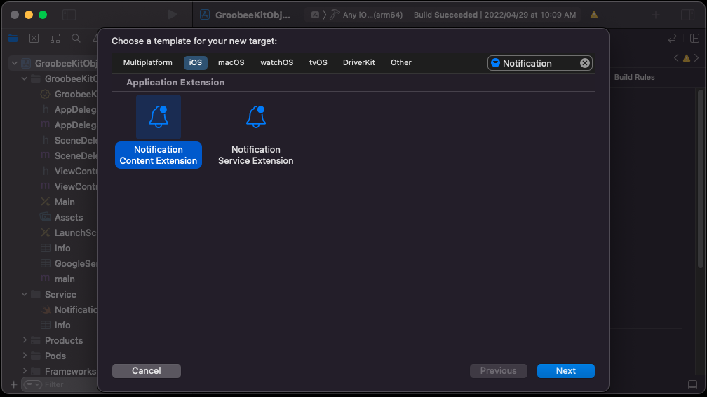

3. `Product Name`을 `Content`로 입력하고 `Language`를 `Swift`로 설정한 뒤 `Finish`를 클릭하고, 다이얼로그에서 `Activate`를 눌러 Content 스키마를 활성화합니다.

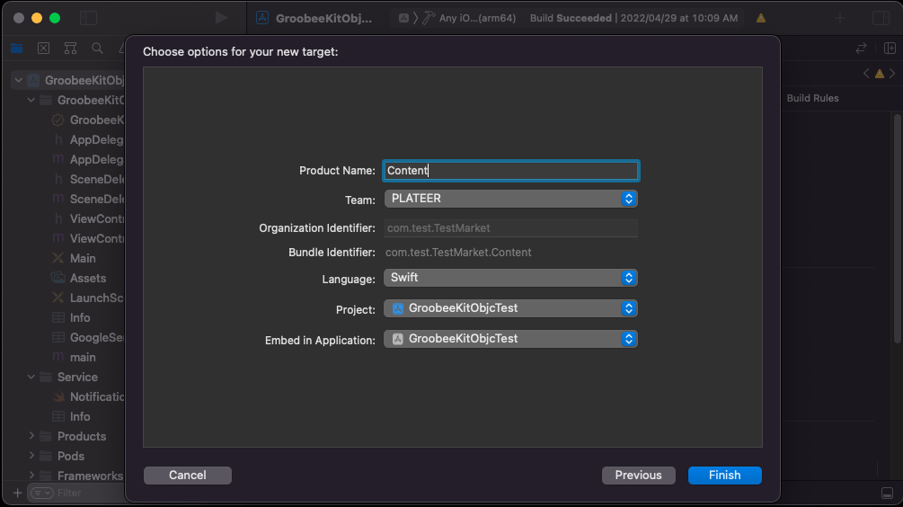

4. Content의 `Deployment Info`에서 iOS 버전을 현재 앱 프로젝트의 Deployment Target과 동일하게 설정합니다. 그리고 `Frameworks and Libraries`에 `GroobeeKit.xcframework`를 추가하고 `Embed`를 `Do Not Embed`로 설정합니다.

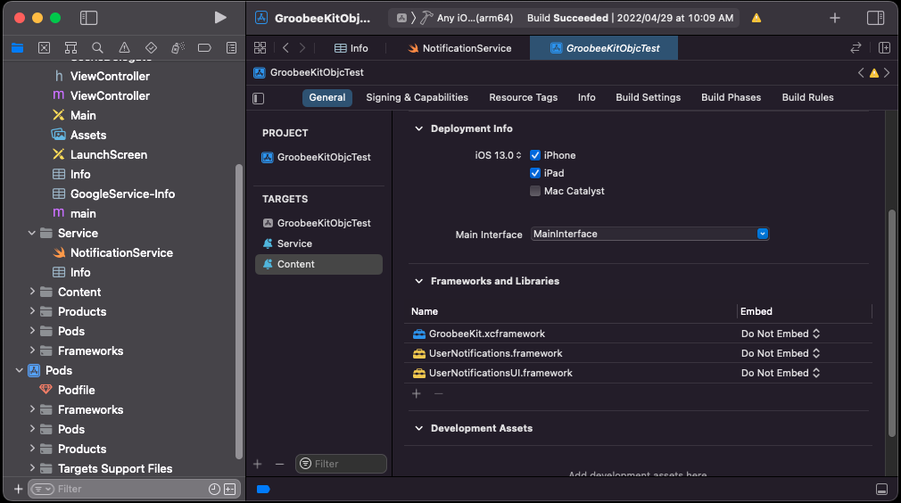

5. `Content -> Info.plist`에 아래 항목을 추가합니다.

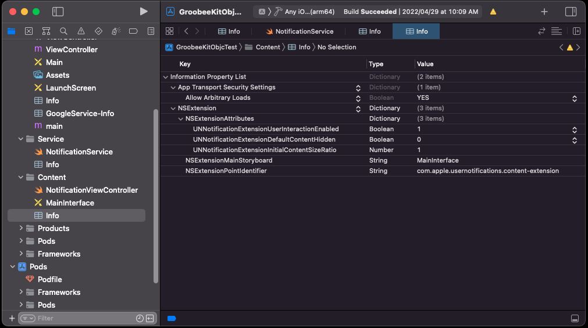

| Key | Type | Value |
| --- | --- | --- |
| `App Transport Security Settings` | Dictionary | `(1 item)` |
| `Allow Arbitrary Loads` | Boolean | `YES` |

| Key | Type | Value |
| --- | --- | --- |
| `NSExtensionAttributes` | Dictionary | `(3 items)` |
| `UNNotificationExtensionUserInteractionEnabled` | Boolean | `1` |
| `UNNotificationExtensionDefaultContentHidden` | Boolean | `0` |
| `UNNotificationExtensionInitialContentSizeRatio` | Number | `1` |

6. `NotificationViewController.swift`에 아래 코드를 작성합니다.

Firebase 메시징 서비스가 이미 등록되어 있는 경우 `GroobeeNotification.getInstance().receiveContent()`를 통해 `notification` 객체를 그루비에 전달할 수 있습니다.

`NotificationService.swift`에 추가한 분기 로직과 동일하게 Content에도 분기 코드를 작성합니다.

```swift
import UIKit
import UserNotifications
import UserNotificationsUI
import Foundation
import GroobeeKit

class NotificationViewController: UIViewController, UNNotificationContentExtension {
    @IBOutlet var label: UILabel?

    func didReceive(_ notification: UNNotification) {
        if GroobeeNotification.getInstance().receiveContent(notification) {
            // Groobee Push Message
        } else {
            // Check if message contains a notification payload.
        }
    }

    func didReceive(
        _ response: UNNotificationResponse,
        completionHandler completion: @escaping (UNNotificationContentExtensionResponseOption) -> Void
    ) {
        completion(.doNotDismiss)
    }
}
```

> Rich Push의 상세 Xcode 설정 화면과 스크린샷은 [iOS Native SDK 설치 가이드](./installation-ios-sdk.md)의 **Rich Push 설정** 섹션과 동일합니다. Flutter 프로젝트에서도 `Runner` 프로젝트에 Extension을 추가하는 절차 자체는 Native iOS와 동일하게 적용됩니다.

---

<a id="method-channel"></a>
## Flutter 브리지 구현 문서

Flutter 앱에서는 Dart 측 코드에서 Groobee SDK 메소드를 직접 호출할 수 없기 때문에, `MethodChannel`을 이용해 Dart ↔ iOS 사이를 연결해야 합니다.

- [Flutter iOS SDK MethodChannel 연동](../detail/ios-flutter-method-channel.md)

Dart 측에서는 FCM 토큰 생성 전에 `Firebase.initializeApp()`을 먼저 호출해야 합니다. (주의: 프로젝트 하위에 `GoogleService-Info.plist`가 포함되어 있어야 합니다.)

```dart
Future<void> initializeDefault() async {
  await Firebase.initializeApp();
  getFcmToken();
}
```

---

<a id="sdk-methods"></a>
## 설치 후 연동 문서

### 개요 및 지원 범위

- [iOS SDK 개요 및 지원 범위](../detail/ios-sdk-overview.md)

### 회원 정보 및 푸시 상태

- [iOS SDK 회원 정보 및 푸시 상태 연동](../detail/ios-sdk-member-push.md)

### 행동 이력 수집

- [iOS SDK 행동 이력 수집](../detail/ios-sdk-actions.md)

### 하이브리드 앱 데이터 동기화

- [iOS SDK 하이브리드 앱 데이터 동기화](../detail/ios-sdk-hybrid-sync.md)

### 추천 상품 연동

- [iOS SDK 추천 상품 연동](../detail/ios-sdk-recommend.md)

### 주의사항 및 로그 유틸리티

- [iOS SDK 주의사항 및 로그 유틸리티](../detail/ios-sdk-cautions-log.md)

### Flutter 브리지 구현

- [Flutter iOS SDK MethodChannel 연동](../detail/ios-flutter-method-channel.md)
