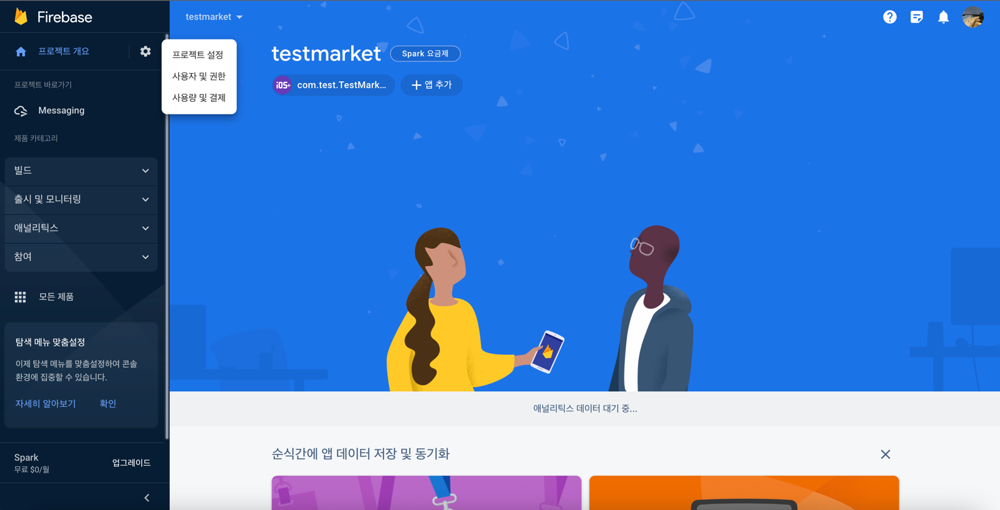
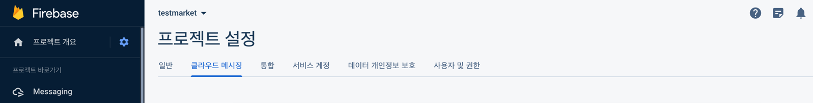
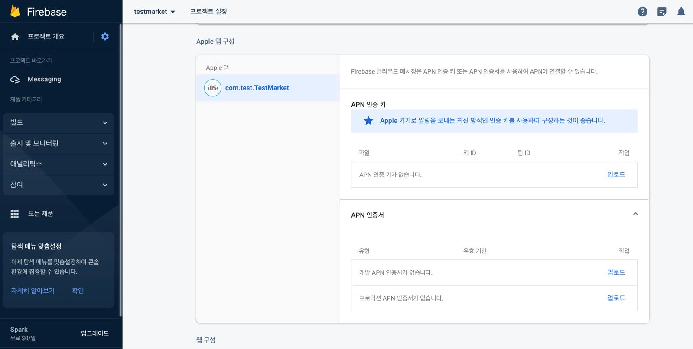
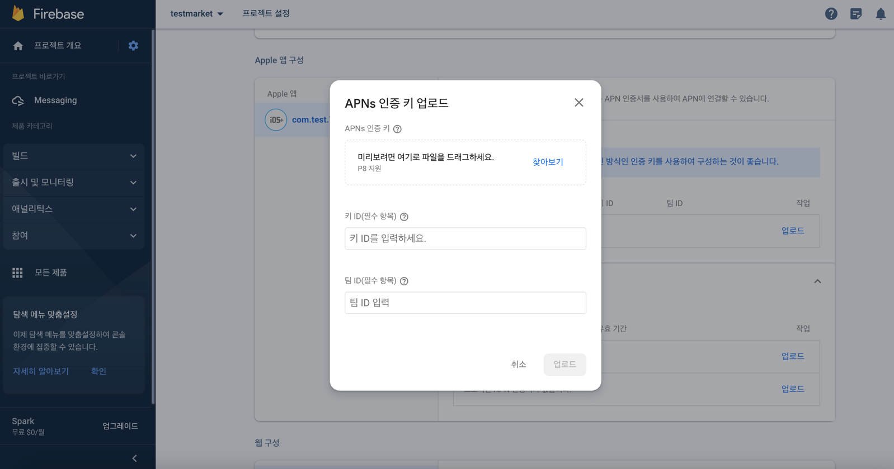

# Groobee iOS SDK 설치 가이드 (Native)

이 문서는 Groobee iOS SDK(Native) `1.1.1` 기준으로 iOS 네이티브 앱(Swift, Objective-C)의 설치 절차만 정리한 문서입니다.

기능별 사용 문서는 아래 문서를 참고하세요.

- [iOS SDK 개요 및 지원 범위](../detail/ios-sdk-overview.md)
- [iOS SDK 회원 정보 및 푸시 상태 연동](../detail/ios-sdk-member-push.md)
- [iOS SDK 화면 이벤트 및 행동 이력 연동](../detail/ios-sdk-screen-events.md)
- [iOS SDK 하이브리드 앱 데이터 동기화](../detail/ios-sdk-hybrid-sync.md)
- [iOS SDK 추천 상품 연동](../detail/ios-sdk-recommend.md)
- [iOS SDK 주의사항 및 로그 유틸리티](../detail/ios-sdk-cautions-log.md)

Flutter 앱(iOS 빌드)에서 `MethodChannel`로 연동하는 경우에는 [iOS Flutter SDK 설치 가이드](./installation-ios-flutter-sdk.md)를 참고하세요.

<a id="sdk-overview"></a>
## 설치 전 확인

- Groobee 서비스키
- [앱 정보 등록 (앱 패키지명 / Bundle ID / 플랫폼 정보)](../prerequisites/app-name-registration.md)
- 푸시 사용 시 Firebase 프로젝트 설정과 Firebase 비공개키 업로드
- APNS 인증 키(`.p8`), Key ID, Team ID
- Xcode에서 Push Notifications, Background Modes 활성화

SDK 개요와 iOS 버전 이슈는 [iOS SDK 개요 및 지원 범위](../detail/ios-sdk-overview.md) 문서에 정리했습니다.

---

<a id="sdk-install"></a>
## SDK 설치

### 1. GroobeeKit 라이브러리 설치

앱 프로젝트 폴더에 `Podfile`을 생성하고 아래와 같이 추가합니다.

Native:

```ruby
pod 'FirebaseFirestore'
pod 'FirebaseMessaging'
pod 'GroobeeKit'
```

React-Native 참고:

```ruby
pod 'GoogleUtilities', :modular_headers => true
pod 'FirebaseCore', :modular_headers => true
pod 'FirebaseMessaging', :modular_headers => true
pod 'GroobeeKit'
```

### 2. Pod install

터미널에서 앱 프로젝트 경로로 이동한 뒤 `pod install`을 실행합니다.

```bash
pod install
```

---

<a id="appdelegate-config"></a>
## AppDelegate 설정

### import 및 상속 설정

Swift:

```swift
import UIKit
import FirebaseCore
import FirebaseMessaging
import GroobeeKit
import UserNotifications

@main
class AppDelegate: UIResponder, UIApplicationDelegate {
    ...
}
```

Objective-C:

```objectivec
#import "AppDelegate.h"
#import <GroobeeKit/GroobeeKit-Swift.h>

@import FirebaseCore;
@import FirebaseMessaging;
@import UserNotifications;

@interface AppDelegate () <UNUserNotificationCenterDelegate, FIRMessagingDelegate>

@end

@implementation AppDelegate

...
```

React-Native 참고:

```objectivec
#import "AppDelegate.h"

#import <React/RCTBundleURLProvider.h>
#import <GroobeeKit/GroobeeKit-Swift.h>
#import <UserNotifications/UserNotifications.h>
#import <FirebaseCore/FirebaseCore.h>
#import <FirebaseMessaging/FirebaseMessaging.h>

@interface AppDelegate () <UNUserNotificationCenterDelegate, FIRMessagingDelegate>

@end

@implementation AppDelegate

...
```

### AppDelegate 주요 설정 항목

| 클래스 | 메소드 | 설명 |
| --- | --- | --- |
| `GroobeeConfig` | `setServiceKey()` | 필수. 그루비 어드민에서 발급받은 서비스키를 등록합니다. |
| `GroobeeConfig` | `setInAppMsgMarginTop()` | 선택. 인앱메시지 상단 노출일 경우 마진값을 설정합니다. |
| `GroobeeConfig` | `setInAppMsgMarginBottom()` | 선택. 인앱메시지 하단 노출일 경우 마진값을 설정합니다. |
| `GroobeeConfig` | `setNotificationSettingsButton()` | 선택. 푸시 알림 하단에 수신 설정 버튼을 추가합니다. 버튼 텍스트는 `NSLocalizedString`으로 다국어화된 텍스트 사용을 권장하며, 앱에 알림 수신 설정 페이지로 이동할 딥링크 처리가 별도로 필요합니다. |
| `Groobee` | `configure()` | 필수. 설정한 `GroobeeConfig`를 앱에 적용합니다. |
| `FirebaseApp` | `configure()` | 필수. FCM 활용을 위한 Firebase 연동입니다. |
| `Messaging` | `messaging().delegate` | 필수. FCM 활용을 위한 Firebase Messaging 연동입니다. |

### Swift 예시

`AppDelegate.swift`의 `application(_:didFinishLaunchingWithOptions:)` 메소드에 다음 코드를 추가합니다.

```swift
func application(
    _ application: UIApplication,
    didFinishLaunchingWithOptions launchOptions: [UIApplication.LaunchOptionsKey: Any]?
) -> Bool {
    let serviceKey = "서비스키"
    let bundleID = Bundle.main.bundleIdentifier!

    let groobeeConfig = GroobeeConfig.GroobeeConfigBuilder()
        .setServiceKey(serviceKey: serviceKey, bundleId: bundleID)
        .setInAppMsgMarginTop(50)
        .setInAppMsgMarginBottom(17)
        .setNotificationSettingsButton("알림설정", "myapp://set/noti")
        .build()

    Groobee.configure(groobeeConfig: groobeeConfig)

    FirebaseApp.configure()
    Messaging.messaging().delegate = self
    pushNotiConfirmation()
    return true
}

func pushNotiConfirmation() {
    let center = UNUserNotificationCenter.current()
    center.requestAuthorization(
        options: [.badge, .alert, .sound],
        completionHandler: { granted, error in
            if granted {
                print("Notifications permission granted.")
                DispatchQueue.main.async {
                    UIApplication.shared.registerForRemoteNotifications()
                }
            } else {
                print("Notifications permission denied.")
            }
        }
    )
    center.delegate = self
}
```

### Objective-C 예시

```objectivec
- (BOOL)application:(UIApplication *)application didFinishLaunchingWithOptions:(NSDictionary *)launchOptions {
    NSString *bundleId = [[NSBundle mainBundle] bundleIdentifier];
    NSString *serviceKey = @"서비스키";

    GroobeeConfig *groobeeConfig = [[[[[[[GroobeeConfigBuilder alloc] init]
        setServiceKeyWithServiceKey:serviceKey bundleId:bundleId]
        setNotificationSettingsButton:@"알림설정" deeplink:@"myapp://set/noti"]
        setInAppMsgMarginTop:17]
        setInAppMsgMarginBottom:50]
        build];

    [Groobee configureWithGroobeeConfig:groobeeConfig];

    [FIRApp configure];
    [FIRMessaging messaging].delegate = self;
    [self pushNotiConfirmation];
    [application registerForRemoteNotifications];

    return YES;
}

- (void)pushNotiConfirmation {
    if ([UNUserNotificationCenter class] != nil) {
        [UNUserNotificationCenter currentNotificationCenter].delegate = self;
        UNAuthorizationOptions authOptions =
            UNAuthorizationOptionAlert |
            UNAuthorizationOptionSound |
            UNAuthorizationOptionBadge;

        [[UNUserNotificationCenter currentNotificationCenter]
            requestAuthorizationWithOptions:authOptions
                          completionHandler:^(BOOL granted, NSError * _Nullable error) {
                          }];
    }
}
```

---

<a id="lifecycle-config"></a>
## LifeCycle 설정

그루비의 세션과 메시지 처리를 위해 앱의 LifeCycle을 `GroobeeKitLifeCycle`에 연결합니다.

### iOS 13 미만

Swift (`AppDelegate.swift`):

```swift
func applicationWillResignActive(_ application: UIApplication) {
    GroobeeKitLifeCycle.sceneWillResignActive()
}

func applicationDidEnterBackground(_ application: UIApplication) {
    GroobeeKitLifeCycle.sceneDidEnterBackground()
}

func applicationWillEnterForeground(_ application: UIApplication) {
    GroobeeKitLifeCycle.sceneWillEnterForeground()
}

func applicationDidBecomeActive(_ application: UIApplication) {
    GroobeeKitLifeCycle.sceneDidBecomeActive()
}

func applicationWillTerminate(_ application: UIApplication) {
    GroobeeKitLifeCycle.sceneDidDisconnect()
}
```

Objective-C / React-Native (`AppDelegate.m`):

```objectivec
- (void)applicationWillResignActive:(UIApplication *)application {
    [GroobeeKitLifeCycle sceneWillResignActive];
}

- (void)applicationDidEnterBackground:(UIApplication *)application {
    [GroobeeKitLifeCycle sceneDidEnterBackground];
}

- (void)applicationWillEnterForeground:(UIApplication *)application {
    [GroobeeKitLifeCycle sceneWillEnterForeground];
}

- (void)applicationDidBecomeActive:(UIApplication *)application {
    [GroobeeKitLifeCycle sceneDidBecomeActive];
}

- (void)applicationWillTerminate:(UIApplication *)application {
    [GroobeeKitLifeCycle sceneDidDisconnect];
}
```

### iOS 13 이상

Swift (`SceneDelegate.swift`):

```swift
func sceneDidDisconnect(_ scene: UIScene) {
    GroobeeKitLifeCycle.sceneDidDisconnect()
}

func sceneDidBecomeActive(_ scene: UIScene) {
    GroobeeKitLifeCycle.sceneDidBecomeActive()
}

func sceneWillResignActive(_ scene: UIScene) {
    GroobeeKitLifeCycle.sceneWillResignActive()
}

func sceneWillEnterForeground(_ scene: UIScene) {
    GroobeeKitLifeCycle.sceneWillEnterForeground()
}

func sceneDidEnterBackground(_ scene: UIScene) {
    GroobeeKitLifeCycle.sceneDidEnterBackground()
}
```

Swift (`AppDelegate.swift`):

```swift
func application(
    _ application: UIApplication,
    didDiscardSceneSessions sceneSessions: Set<UISceneSession>
) {
    GroobeeKitLifeCycle.sceneDidDisconnect()
}
```

Objective-C (`SceneDelegate.m`):

```objectivec
- (void)sceneDidDisconnect:(UIScene *)scene {
    [GroobeeKitLifeCycle sceneDidDisconnect];
}

- (void)sceneDidBecomeActive:(UIScene *)scene {
    [GroobeeKitLifeCycle sceneDidBecomeActive];
}

- (void)sceneWillResignActive:(UIScene *)scene {
    [GroobeeKitLifeCycle sceneWillResignActive];
}

- (void)sceneWillEnterForeground:(UIScene *)scene {
    [GroobeeKitLifeCycle sceneWillEnterForeground];
}

- (void)sceneDidEnterBackground:(UIScene *)scene {
    [GroobeeKitLifeCycle sceneDidEnterBackground];
}
```

Objective-C (`AppDelegate.m`):

```objectivec
- (void)application:(UIApplication *)application
didDiscardSceneSessions:(NSSet<UISceneSession *> *)sceneSessions {
    [GroobeeKitLifeCycle sceneDidDisconnect];
}
```

---

<a id="push-service"></a>
## Push Messaging Service 설정

### FCM과 APNS 연동 방법

1. Firebase 콘솔에서 왼쪽 첫 번째 메뉴 항목인 `프로젝트 개요`를 열고 `프로젝트 설정`으로 진입합니다.



2. 프로젝트 설정에서 아래 메뉴 탭의 `클라우드 메시징` 항목을 엽니다.



3. 클라우드 메시징 항목에서 `Apple 앱 구성`까지 스크롤하여 사용 중인 iOS 앱의 Bundle ID를 확인하고, `APN 인증 키` 하위의 `업로드` 버튼을 클릭합니다.



4. 내려받은 `.p8` 파일을 업로드하고 Key ID, Team ID를 입력해 업로드를 완료합니다.



참고 링크:

- APNS 연동 공식 문서: [Firebase Cloud Messaging for iOS](https://firebase.google.com/docs/cloud-messaging/ios/client?hl=ko)
- Apple Auth Key 관리: [Apple Developer Auth Keys](https://developer.apple.com/account/resources/authkeys/list)
- Apple Team 정보: [Apple Developer Account](https://developer.apple.com/account)

### FCM과 GroobeeKit 간 메시지 연동

Swift:

```swift
extension AppDelegate: MessagingDelegate, UNUserNotificationCenterDelegate {
    func application(
        _ application: UIApplication,
        didRegisterForRemoteNotificationsWithDeviceToken deviceToken: Data
    ) {
        Messaging.messaging().apnsToken = deviceToken
    }

    func application(
        _ application: UIApplication,
        didReceiveRemoteNotification userInfo: [AnyHashable: Any],
        fetchCompletionHandler completionHandler: @escaping (UIBackgroundFetchResult) -> Void
    ) {
        Groobee.getInstance().didReceiveRemoteNotification(userInfo: userInfo)
        completionHandler(.newData)
    }

    func messaging(_ messaging: Messaging, didReceiveRegistrationToken fcmToken: String?) {
        let dataDict: [String: String] = ["token": fcmToken ?? ""]
        Groobee.getInstance().setPushToken(pushToken: fcmToken!)
        NotificationCenter.default.post(
            name: Notification.Name("FCMToken"),
            object: nil,
            userInfo: dataDict
        )
    }

    func userNotificationCenter(
        _ center: UNUserNotificationCenter,
        willPresent notification: UNNotification,
        withCompletionHandler completionHandler: @escaping (UNNotificationPresentationOptions) -> Void
    ) {
        completionHandler([.alert, .badge, .sound])
    }

    func userNotificationCenter(
        _ center: UNUserNotificationCenter,
        didReceive response: UNNotificationResponse,
        withCompletionHandler completionHandler: @escaping () -> Void
    ) {
        let notification = response.notification
        let userInfo = notification.request.content.userInfo

        switch response.actionIdentifier {
        case UNNotificationDefaultActionIdentifier:
            Groobee.getInstance().userNotificationCenter(userInfo: userInfo)
        default:
            print("nil")
        }

        completionHandler()
    }
}
```

Objective-C:

```objectivec
- (void)application:(UIApplication *)application
didRegisterForRemoteNotificationsWithDeviceToken:(NSData *)deviceToken {
    [FIRMessaging messaging].APNSToken = deviceToken;
}

- (void)application:(UIApplication *)application
didReceiveRemoteNotification:(NSDictionary *)userInfo
fetchCompletionHandler:(void (^)(UIBackgroundFetchResult))completionHandler {
    [[Groobee getInstance] didReceiveRemoteNotificationWithUserInfo:userInfo];
    completionHandler(UIBackgroundFetchResultNewData);
}

- (void)messaging:(FIRMessaging *)messaging didReceiveRegistrationToken:(NSString *)fcmToken {
    NSDictionary *dataDict = [NSDictionary dictionaryWithObject:fcmToken forKey:@"token"];
    [[NSNotificationCenter defaultCenter] postNotificationName:@"FCMToken" object:nil userInfo:dataDict];
    [[Groobee getInstance] setPushTokenWithPushToken:fcmToken];
}

- (void)userNotificationCenter:(UNUserNotificationCenter *)center
       willPresentNotification:(UNNotification *)notification
         withCompletionHandler:(void (^)(UNNotificationPresentationOptions))completionHandler {
    completionHandler(
        UNNotificationPresentationOptionAlert |
        UNNotificationPresentationOptionBadge |
        UNNotificationPresentationOptionSound
    );
}

- (void)userNotificationCenter:(UNUserNotificationCenter *)center
didReceiveNotificationResponse:(UNNotificationResponse *)response
         withCompletionHandler:(void (^)(void))completionHandler {
    NSDictionary *userInfo = response.notification.request.content.userInfo;
    if ([response.actionIdentifier isEqualToString:@"com.apple.UNNotificationDefaultActionIdentifier"]) {
        [[Groobee getInstance] userNotificationCenterWithUserInfo:userInfo];
    }
    completionHandler();
}
```

---

<a id="rich-push"></a>
## Rich Push 설정

Service와 Content를 추가한 Rich Push 방식을 사용하면 푸시 메시지 전환 상태 측정과 커스텀 푸시 메시지 확장이 가능합니다.

향후 확장될 메시지 유형들을 유연하게 제공하는 것을 목표로 하고 있으며, 사용자들에게 다양하고 원활한 정보 전달을 위해 그루비는 Rich Push를 사용하고 있습니다.

따라서 `Notification Service Extension`, `Notification Content Extension`을 추가하고 가이드에 맞춰 진행하시길 바랍니다.

### Notification Service Extension

사용자에게 전달되기 전 Remote Notification의 내용을 수정하는 확장입니다. 이미지, 비디오, 오디오, 특별한 형식의 콘텐츠를 알림에 추가하거나, 알림 메시지를 동적으로 생성하여 사용자에게 더 풍부한 정보를 제공할 수 있습니다.

`Notification Service Extension`을 사용하지 않을 경우 iOS 단말기에서는 이미지를 Push Message에 등록할 수 없는 문제가 발생할 수 있습니다.

### Notification Content Extension

앱의 알림에 대한 사용자 지정 인터페이스를 표시하는 확장입니다. 사용자 지정 색상, 브랜딩, 미디어, 동적 콘텐츠를 알림 인터페이스에 통합할 수 있습니다.

참고 링크:

- [UNNotificationServiceExtension](https://developer.apple.com/documentation/usernotifications/unnotificationserviceextension)
- [UNNotificationContentExtension](https://developer.apple.com/documentation/usernotificationsui/unnotificationcontentextension)

### Service 설정

1. `+ Capabilities` 버튼을 눌러 `Push Notifications`와 `Background Modes`를 추가하고, `Background fetch`와 `Remote notifications`를 체크하여 활성화합니다.


2. `TARGETS` 하단의 `+` 버튼을 클릭합니다.


3. `Notification` 검색 후 `Notification Service Extension`을 선택하여 `Next`로 진행합니다.


4. `Product Name`을 `Service`로 설정하고 `Language`를 `Swift`로 선택한 뒤 `Finish`를 클릭합니다. 이어서 `Activate`를 눌러 Service 스키마를 활성화합니다.


5. Service의 `Deployment Info`에서 iOS 버전을 현재 앱의 Deployment Target과 동일하게 맞추고, `Frameworks and Libraries`에 `GroobeeKit.xcframework`를 추가한 뒤 `Embed`를 `Do Not Embed`로 설정합니다.


6. `Service -> Info.plist`에 아래 항목을 추가합니다.


| Key | Type | Value |
| --- | --- | --- |
| `App Transport Security Settings` | Dictionary | `(1 item)` |
| `Allow Arbitrary Loads` | Boolean | `YES` |

7. `NotificationService.swift`에 아래 코드를 작성합니다.

Firebase 메시징 서비스가 이미 등록되어 있는 경우 `GroobeeNotification.getInstance().receiveService()`를 통해 `request`, `bestAttemptContent`, `contentHandler` 객체를 그루비에 전달할 수 있습니다.

또한 그루비는 Admin에서 발송한 메시지만 렌더링할 수 있도록 분기 처리 로직이 포함되어 있습니다. 다른 FCM 서비스를 이용 중인 경우에는 `else` 구간에 코드를 삽입해 메시징 핸들링을 제어할 수 있습니다.

```swift
import UserNotifications
import Foundation
import GroobeeKit

class NotificationService: UNNotificationServiceExtension {
    var contentHandler: ((UNNotificationContent) -> Void)?
    var bestAttemptContent: UNMutableNotificationContent?

    override func didReceive(
        _ request: UNNotificationRequest,
        withContentHandler contentHandler: @escaping (UNNotificationContent) -> Void
    ) {
        self.contentHandler = contentHandler
        bestAttemptContent = request.content.mutableCopy() as? UNMutableNotificationContent

        if let bestAttemptContent = bestAttemptContent {
            if GroobeeNotification.getInstance().receiveService(
                request,
                bestAttemptContent,
                withContentHandler: contentHandler
            ) {
                // Groobee Push Message
            } else {
                // Check if message contains a notification payload.
            }
        }
    }

    override func serviceExtensionTimeWillExpire() {
        if let contentHandler = contentHandler, let bestAttemptContent = bestAttemptContent {
            contentHandler(bestAttemptContent)
        }
    }
}
```

### Content 설정

1. `TARGETS` 하단의 `+` 버튼을 클릭합니다.


2. `Notification` 검색 후 `Notification Content Extension`을 선택하여 `Next`로 진행합니다.


3. `Product Name`을 `Content`로 설정하고 `Language`를 `Swift`로 선택한 뒤 `Finish`를 클릭합니다. 이어서 `Activate`를 눌러 Content 스키마를 활성화합니다.


4. Content의 `Deployment Info`에서 iOS 버전을 현재 앱의 Deployment Target과 동일하게 맞추고, `Frameworks and Libraries`에 `GroobeeKit.xcframework`를 추가한 뒤 `Embed`를 `Do Not Embed`로 설정합니다.


5. `Content -> Info.plist`에 아래 항목을 추가합니다.


Content Info.plist:

| Key | Type | Value |
| --- | --- | --- |
| `App Transport Security Settings` | Dictionary | `(1 item)` |
| `Allow Arbitrary Loads` | Boolean | `YES` |

| Key | Type | Value |
| --- | --- | --- |
| `NSExtensionAttributes` | Dictionary | `(3 item)` |
| `UNNotificationExtensionUserInteractionEnabled` | Boolean | `1` |
| `UNNotificationExtensionDefaultContentHidden` | Boolean | `0` |
| `UNNotificationExtensionInitialContentSizeRatio` | Number | `1` |

6. `NotificationViewController.swift`에 아래 코드를 작성합니다.

Firebase 메시징 서비스가 이미 등록되어 있는 경우 `GroobeeNotification.getInstance().receiveContent()`를 통해 `notification` 객체를 그루비에 전달할 수 있습니다.

`NotificationService.swift`에 추가한 분기 로직과 동일하게 Content에도 분기 코드를 작성합니다.

```swift
import UIKit
import UserNotifications
import UserNotificationsUI
import Foundation
import GroobeeKit

class NotificationViewController: UIViewController, UNNotificationContentExtension {
    @IBOutlet var label: UILabel?

    func didReceive(_ notification: UNNotification) {
        if GroobeeNotification.getInstance().receiveContent(notification) {
            // Groobee Push Message
        } else {
            // Check if message contains a notification payload.
        }
    }

    func didReceive(
        _ response: UNNotificationResponse,
        completionHandler completion: @escaping (UNNotificationContentExtensionResponseOption) -> Void
    ) {
        completion(.doNotDismiss)
    }
}
```

---

<a id="sdk-methods"></a>
## 설치 후 연동 문서

### 개요 및 지원 범위

- [iOS SDK 개요 및 지원 범위](../detail/ios-sdk-overview.md)

### 회원 정보 및 푸시 상태

- [iOS SDK 회원 정보 및 푸시 상태 연동](../detail/ios-sdk-member-push.md)

### 화면 이벤트 및 행동 이력

- [iOS SDK 화면 이벤트 및 행동 이력 연동](../detail/ios-sdk-screen-events.md)

### 하이브리드 앱 데이터 동기화

- [iOS SDK 하이브리드 앱 데이터 동기화](../detail/ios-sdk-hybrid-sync.md)

### 추천 상품 연동

- [iOS SDK 추천 상품 연동](../detail/ios-sdk-recommend.md)

### 주의사항 및 로그 유틸리티

- [iOS SDK 주의사항 및 로그 유틸리티](../detail/ios-sdk-cautions-log.md)
