# Groobee iOS SDK 설치 가이드 (Native)

이 문서는 Groobee iOS Native SDK의 설치 절차(Swift, Objective-C)를 정리한 문서입니다. 현재 권장 버전은 [iOS SDK 변경 로그](../changelog/sdk-ios-changelog.md)에서 확인하세요.

기능별 사용 문서는 아래 문서를 참고하세요.

- [iOS SDK 개요 및 지원 범위](../detail/ios-sdk-overview.md)
- [iOS SDK 회원 정보 및 푸시 상태 연동](../detail/ios-sdk-member-push.md)
- [iOS SDK 행동 이력 수집](../detail/ios-sdk-actions.md)
- [iOS SDK 하이브리드 앱 데이터 동기화](../detail/ios-sdk-hybrid-sync.md)
- [iOS SDK 추천 상품 연동](../detail/ios-sdk-recommend.md)
- [iOS SDK 주의사항 및 로그 유틸리티](../detail/ios-sdk-cautions-log.md)

Flutter 앱(iOS 빌드)에서 `MethodChannel`로 연동하는 경우에는 [iOS Flutter SDK 설치 가이드](./installation-ios-flutter-sdk.md)를 참고하세요.

---

## 목차

1. [설치 전 확인](#sdk-overview)
2. [SDK 설치](#sdk-install)
3. [AppDelegate 설정](#appdelegate-config)
4. [LifeCycle 설정](#lifecycle-config)
5. [Push Messaging Service 설정](#push-service)
6. [Rich Push 설정](#rich-push)
7. [설치 후 연동 문서](#sdk-methods)

---

<a id="sdk-overview"></a>
## 설치 전 확인

- Groobee 서비스키
- [앱 정보 등록 (앱 패키지명 / Bundle ID / 플랫폼 정보)](../prerequisites/app-name-registration.md)
- 푸시 사용 시 Firebase 프로젝트 설정과 Firebase 비공개키 업로드 — 어드민 등록 방법은 [어드민 푸시 설정 가이드](https://docs.groobee.ai/new-admin/settings/push)를 참고하세요.
- APNS 인증 키(`.p8`), Key ID, Team ID
- Xcode에서 Push Notifications, Background Modes 활성화

SDK 개요와 iOS 버전 이슈는 [iOS SDK 개요 및 지원 범위](../detail/ios-sdk-overview.md) 문서에 정리했습니다.

---

<a id="sdk-install"></a>
## SDK 설치

### 1. GroobeeKit 라이브러리 설치

앱 프로젝트 폴더에 `Podfile`을 생성하고 아래와 같이 추가합니다.

Native:

```ruby
pod 'FirebaseCore'
pod 'FirebaseMessaging'
pod 'GroobeeKit'
```

React-Native 참고:

```ruby
pod 'GoogleUtilities', :modular_headers => true
pod 'FirebaseCore', :modular_headers => true
pod 'FirebaseMessaging', :modular_headers => true
pod 'GroobeeKit'
```

### 2. Pod install

터미널에서 앱 프로젝트 경로로 이동한 뒤 `pod install`을 실행합니다.

```bash
pod install
```

---

<a id="appdelegate-config"></a>
## AppDelegate 설정

### import 및 상속 설정

Swift:

```swift
import UIKit
import FirebaseCore
import FirebaseMessaging
import GroobeeKit
import UserNotifications

@main
class AppDelegate: UIResponder, UIApplicationDelegate {
    ...
}
```

Objective-C:

```objectivec
#import "AppDelegate.h"
#import <GroobeeKit/GroobeeKit-Swift.h>

@import FirebaseCore;
@import FirebaseMessaging;
@import UserNotifications;

@interface AppDelegate () <UNUserNotificationCenterDelegate, FIRMessagingDelegate>

@end

@implementation AppDelegate

...
```

React-Native 참고:

```objectivec
#import "AppDelegate.h"

#import <React/RCTBundleURLProvider.h>
#import <GroobeeKit/GroobeeKit-Swift.h>
#import <UserNotifications/UserNotifications.h>
#import <FirebaseCore/FirebaseCore.h>
#import <FirebaseMessaging/FirebaseMessaging.h>

@interface AppDelegate () <UNUserNotificationCenterDelegate, FIRMessagingDelegate>

@end

@implementation AppDelegate

...
```

### AppDelegate 주요 설정 항목

| 클래스 | 메소드 | 설명 |
| --- | --- | --- |
| `GroobeeConfig` | `setServiceKey()` | 필수. 그루비 어드민에서 발급받은 서비스키를 등록합니다. |
| `GroobeeConfig` | `setInAppMsgMarginTop()` | 선택. 인앱메시지 상단 노출일 경우 마진값을 설정합니다. |
| `GroobeeConfig` | `setInAppMsgMarginBottom()` | 선택. 인앱메시지 하단 노출일 경우 마진값을 설정합니다. |
| `GroobeeConfig` | `setInAppMsgMaxHeightRatioPortrait()` | 선택. 세로 화면에서 인앱 팝업 이미지가 쓸 수 있는 높이 비율의 상한을 설정합니다. 기본값 `0.9`, 허용 범위 `0.4` ~ `0.9`. (SDK 1.1.13 신설) |
| `GroobeeConfig` | `setInAppMsgMaxHeightRatioLandscape()` | 선택. 가로 화면에서 인앱 팝업 이미지가 쓸 수 있는 높이 비율의 상한을 설정합니다. 기본값 `0.9`, 허용 범위 `0.4` ~ `0.9`. (SDK 1.1.13 신설) |
| `GroobeeConfig` | `setInAppMsgCloseButtonScale()` | 선택. 인앱 팝업 닫기(X) 버튼을 기본 크기의 몇 배로 표시할지 설정합니다. 기본값 `1.0`, 허용 범위 `1.0` ~ `2.0`. (SDK 1.1.14 신설) |
| `GroobeeConfig` | `setNotificationSettingsButton()` | 선택. 푸시 알림 하단에 수신 설정 버튼을 추가합니다. 버튼 텍스트는 `NSLocalizedString`으로 다국어화된 텍스트 사용을 권장하며, 앱에 알림 수신 설정 페이지로 이동할 딥링크 처리가 별도로 필요합니다. |
| `Groobee` | `configure()` | 필수. 설정한 `GroobeeConfig`를 앱에 적용합니다. |
| `FirebaseApp` | `configure()` | 필수. FCM 활용을 위한 Firebase 연동입니다. |
| `Messaging` | `messaging().delegate` | 필수. FCM 활용을 위한 Firebase Messaging 연동입니다. |

### Swift 예시

`AppDelegate.swift`의 `application(_:didFinishLaunchingWithOptions:)` 메소드에 다음 코드를 추가합니다.

```swift
func application(
    _ application: UIApplication,
    didFinishLaunchingWithOptions launchOptions: [UIApplication.LaunchOptionsKey: Any]?
) -> Bool {
    let serviceKey = "서비스키"
    let bundleID = Bundle.main.bundleIdentifier!

    let groobeeConfig = GroobeeConfig.GroobeeConfigBuilder()
        .setServiceKey(serviceKey: serviceKey, bundleId: bundleID)
        .setInAppMsgMarginTop(50)
        .setInAppMsgMarginBottom(17)
        .setNotificationSettingsButton("알림설정", "myapp://set/noti")
        .build()

    Groobee.configure(groobeeConfig: groobeeConfig)

    FirebaseApp.configure()
    Messaging.messaging().delegate = self
    pushNotiConfirmation()
    return true
}

func pushNotiConfirmation() {
    let center = UNUserNotificationCenter.current()
    center.requestAuthorization(
        options: [.badge, .alert, .sound],
        completionHandler: { granted, error in
            if granted {
                print("Notifications permission granted.")
                DispatchQueue.main.async {
                    UIApplication.shared.registerForRemoteNotifications()
                }
            } else {
                print("Notifications permission denied.")
            }
        }
    )
    center.delegate = self
}
```

### Objective-C 예시

```objectivec
- (BOOL)application:(UIApplication *)application didFinishLaunchingWithOptions:(NSDictionary *)launchOptions {
    NSString *bundleId = [[NSBundle mainBundle] bundleIdentifier];
    NSString *serviceKey = @"서비스키";

    GroobeeConfig *groobeeConfig = [[[[[[[GroobeeConfigBuilder alloc] init]
        setServiceKeyWithServiceKey:serviceKey bundleId:bundleId]
        setNotificationSettingsButton:@"알림설정" deeplink:@"myapp://set/noti"]
        setInAppMsgMarginTop:17]
        setInAppMsgMarginBottom:50]
        build];

    [Groobee configureWithGroobeeConfig:groobeeConfig];

    [FIRApp configure];
    [FIRMessaging messaging].delegate = self;
    [self pushNotiConfirmation];
    [application registerForRemoteNotifications];

    return YES;
}

- (void)pushNotiConfirmation {
    if ([UNUserNotificationCenter class] != nil) {
        [UNUserNotificationCenter currentNotificationCenter].delegate = self;
        UNAuthorizationOptions authOptions =
            UNAuthorizationOptionAlert |
            UNAuthorizationOptionSound |
            UNAuthorizationOptionBadge;

        [[UNUserNotificationCenter currentNotificationCenter]
            requestAuthorizationWithOptions:authOptions
                          completionHandler:^(BOOL granted, NSError * _Nullable error) {
                          }];
    }
}
```

---

<a id="inapp-popup-height-ratio"></a>
### 인앱 팝업 이미지 높이 상한 (SDK 1.1.13 이상)

`setInAppMsgMaxHeightRatioPortrait()` / `setInAppMsgMaxHeightRatioLandscape()`로 **인앱 팝업(POPUP) 이미지**가 차지할 수 있는 높이의 상한을 조절할 수 있습니다. 두 메소드 모두 **선택 사항**이며, 호출하지 않으면 기본값으로 동작합니다.

```swift
let groobeeConfig = GroobeeConfig.GroobeeConfigBuilder()
    .setServiceKey(serviceKey: serviceKey, bundleId: bundleID)
    .setInAppMsgMaxHeightRatioPortrait(0.8)   // 세로 화면 상한
    .setInAppMsgMaxHeightRatioLandscape(0.7)  // 가로 화면 상한
    .build()

Groobee.configure(groobeeConfig: groobeeConfig)
```

```objectivec
GroobeeConfig *groobeeConfig = [[[[[[GroobeeConfigBuilder alloc] init]
    setServiceKeyWithServiceKey:serviceKey bundleId:bundleId]
    setInAppMsgMaxHeightRatioPortrait:0.8]
    setInAppMsgMaxHeightRatioLandscape:0.7]
    build];
```

| 항목 | 값 |
| --- | --- |
| 기본값 | `0.9` (세로 · 가로 동일) |
| 허용 범위 | `0.4` ~ `0.9` |
| 범위를 벗어난 값 | 가까운 끝값으로 조정됩니다 (`0.9` 초과 → `0.9`, `0.4` 미만 → `0.4`). 팝업은 정상 노출됩니다 |
| `0` 이하 또는 유효하지 않은 값 | 기본값 `0.9`으로 동작합니다 |

- **기준은 화면 전체 높이가 아니라 「안전영역(safe area) 높이」입니다.** 상태바·노치·홈 인디케이터를 제외한 높이를 기준으로 계산합니다.
- **적용 대상은 인앱 메시지 중 팝업(POPUP, 이미지 팝업)뿐입니다.**
- **세로 화면에서는 값을 낮춰도 차이가 거의 없습니다.** 세로에서는 보통 이미지의 폭이 먼저 화면에 닿기 때문에 높이 상한까지 도달하지 않습니다.
- **가로 화면에서는 이 값이 곧 팝업 크기입니다.** 값을 낮추면 팝업이 작아지고 위아래 딤(어두운) 배경이 더 보입니다.
- 가로·세로 구분은 기기의 물리적 방향이 아니라 **그 순간 앱이 쓸 수 있는 영역의 가로세로 비율**로 판단합니다.

> Android SDK에도 같은 이름·같은 규칙의 설정이 있습니다(기준 높이만 플랫폼에 따라 다릅니다). [Android SDK 설치 가이드](./installation-android-sdk.md#inapp-popup-height-ratio) 참고.

---

<a id="inapp-close-button-scale"></a>
### 인앱 팝업 닫기 버튼 크기 (SDK 1.1.14 이상)

`setInAppMsgCloseButtonScale()`로 **인앱 팝업(POPUP)의 닫기(X) 버튼**을 기본 크기의 몇 배로 표시할지 설정할 수 있습니다. 예를 들어 `1.8`을 넣으면 닫기 버튼이 기본의 1.8배 크기로 표시됩니다. **선택 사항**이며, 호출하지 않으면 기본 크기 그대로 표시됩니다.

```swift
let groobeeConfig = GroobeeConfig.GroobeeConfigBuilder()
    .setServiceKey(serviceKey: serviceKey, bundleId: bundleID)
    .setInAppMsgCloseButtonScale(1.8)  // 닫기 버튼을 기본의 1.8배로
    .build()

Groobee.configure(groobeeConfig: groobeeConfig)
```

```objectivec
GroobeeConfig *groobeeConfig = [[[[[GroobeeConfigBuilder alloc] init]
    setServiceKeyWithServiceKey:serviceKey bundleId:bundleId]
    setInAppMsgCloseButtonScale:1.8]
    build];
```

| 항목 | 값 |
| --- | --- |
| 기본값 | `1.0` (기본 크기) |
| 허용 범위 | `1.0` ~ `2.0` |
| 범위를 벗어난 값 | 가까운 끝값으로 조정됩니다 (`2.0` 초과 → `2.0`, `1.0` 미만 → `1.0`) |

- **적용 대상은 인앱 메시지 중 팝업(POPUP)뿐입니다.** 다른 유형의 인앱 메시지 닫기 버튼은 크기가 바뀌지 않습니다.

---

<a id="lifecycle-config"></a>
## LifeCycle 설정

그루비의 세션과 메시지 처리를 위해 앱의 LifeCycle을 `GroobeeKitLifeCycle`에 연결합니다.

### iOS 13 미만

Swift (`AppDelegate.swift`):

```swift
func applicationWillResignActive(_ application: UIApplication) {
    GroobeeKitLifeCycle.sceneWillResignActive()
}

func applicationDidEnterBackground(_ application: UIApplication) {
    GroobeeKitLifeCycle.sceneDidEnterBackground()
}

func applicationWillEnterForeground(_ application: UIApplication) {
    GroobeeKitLifeCycle.sceneWillEnterForeground()
}

func applicationDidBecomeActive(_ application: UIApplication) {
    GroobeeKitLifeCycle.sceneDidBecomeActive()
}

func applicationWillTerminate(_ application: UIApplication) {
    GroobeeKitLifeCycle.sceneDidDisconnect()
}
```

Objective-C / React-Native (`AppDelegate.m`):

```objectivec
- (void)applicationWillResignActive:(UIApplication *)application {
    [GroobeeKitLifeCycle sceneWillResignActive];
}

- (void)applicationDidEnterBackground:(UIApplication *)application {
    [GroobeeKitLifeCycle sceneDidEnterBackground];
}

- (void)applicationWillEnterForeground:(UIApplication *)application {
    [GroobeeKitLifeCycle sceneWillEnterForeground];
}

- (void)applicationDidBecomeActive:(UIApplication *)application {
    [GroobeeKitLifeCycle sceneDidBecomeActive];
}

- (void)applicationWillTerminate:(UIApplication *)application {
    [GroobeeKitLifeCycle sceneDidDisconnect];
}
```

### iOS 13 이상

Swift (`SceneDelegate.swift`):

```swift
func sceneDidDisconnect(_ scene: UIScene) {
    GroobeeKitLifeCycle.sceneDidDisconnect()
}

func sceneDidBecomeActive(_ scene: UIScene) {
    GroobeeKitLifeCycle.sceneDidBecomeActive()
}

func sceneWillResignActive(_ scene: UIScene) {
    GroobeeKitLifeCycle.sceneWillResignActive()
}

func sceneWillEnterForeground(_ scene: UIScene) {
    GroobeeKitLifeCycle.sceneWillEnterForeground()
}

func sceneDidEnterBackground(_ scene: UIScene) {
    GroobeeKitLifeCycle.sceneDidEnterBackground()
}
```

Swift (`AppDelegate.swift`):

```swift
func application(
    _ application: UIApplication,
    didDiscardSceneSessions sceneSessions: Set<UISceneSession>
) {
    GroobeeKitLifeCycle.sceneDidDisconnect()
}
```

Objective-C (`SceneDelegate.m`):

```objectivec
- (void)sceneDidDisconnect:(UIScene *)scene {
    [GroobeeKitLifeCycle sceneDidDisconnect];
}

- (void)sceneDidBecomeActive:(UIScene *)scene {
    [GroobeeKitLifeCycle sceneDidBecomeActive];
}

- (void)sceneWillResignActive:(UIScene *)scene {
    [GroobeeKitLifeCycle sceneWillResignActive];
}

- (void)sceneWillEnterForeground:(UIScene *)scene {
    [GroobeeKitLifeCycle sceneWillEnterForeground];
}

- (void)sceneDidEnterBackground:(UIScene *)scene {
    [GroobeeKitLifeCycle sceneDidEnterBackground];
}
```

Objective-C (`AppDelegate.m`):

```objectivec
- (void)application:(UIApplication *)application
didDiscardSceneSessions:(NSSet<UISceneSession *> *)sceneSessions {
    [GroobeeKitLifeCycle sceneDidDisconnect];
}
```

---

<a id="push-service"></a>
## Push Messaging Service 설정

### FCM과 APNS 연동 방법
iOS의 경우 APNs 인증키를 FCM에 등록해야 FCM을 통한 푸시 발송이 가능합니다.  \
다음은 APNs 인증키를 FCM에 등록하는 방법예시입니다.

1. Firebase 콘솔에서 `설정` > `일반` > `클라우드 메시징` 메뉴로 진입한 후, 등록해둔 앱의 APN 인증키를 업로드 버튼을 누릅니다.

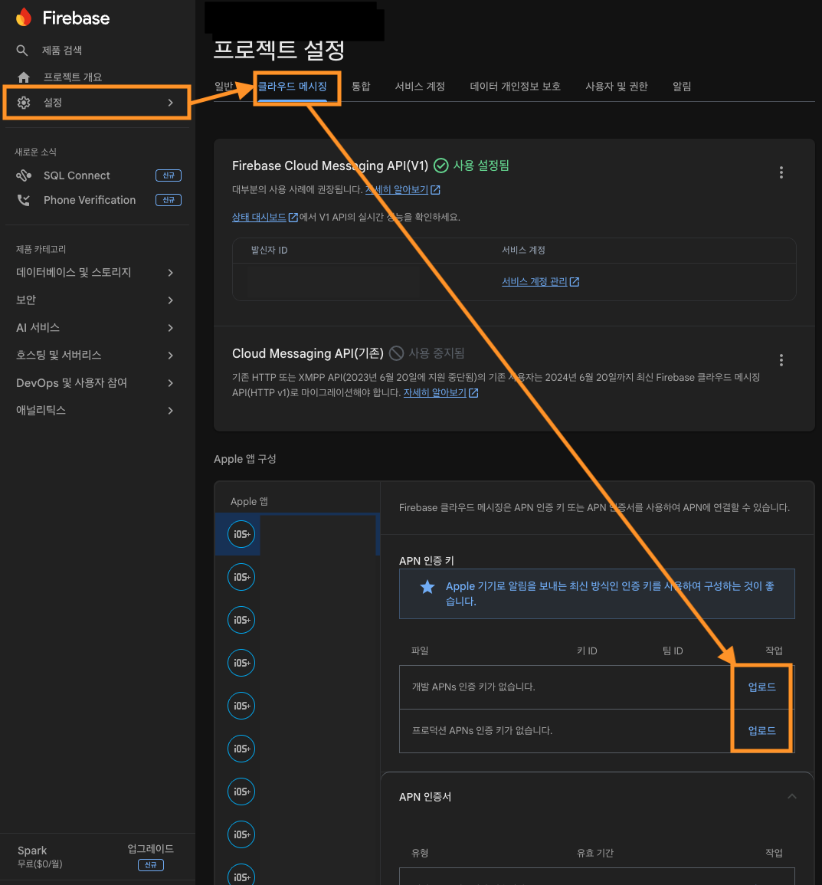

2. 내려받은 `.p8` 파일을 업로드하고 Key ID, Team ID를 입력해 업로드를 완료합니다.

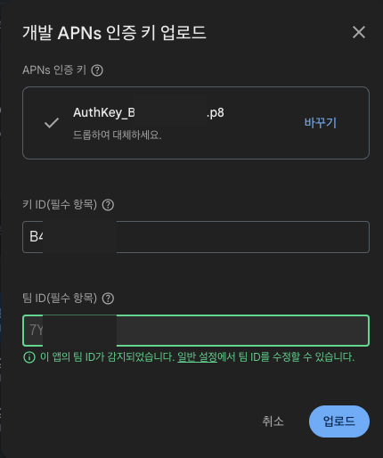

3. 업로드가 완료되면 APNs 인증키가 등록된 것을 확인할 수 있습니다.

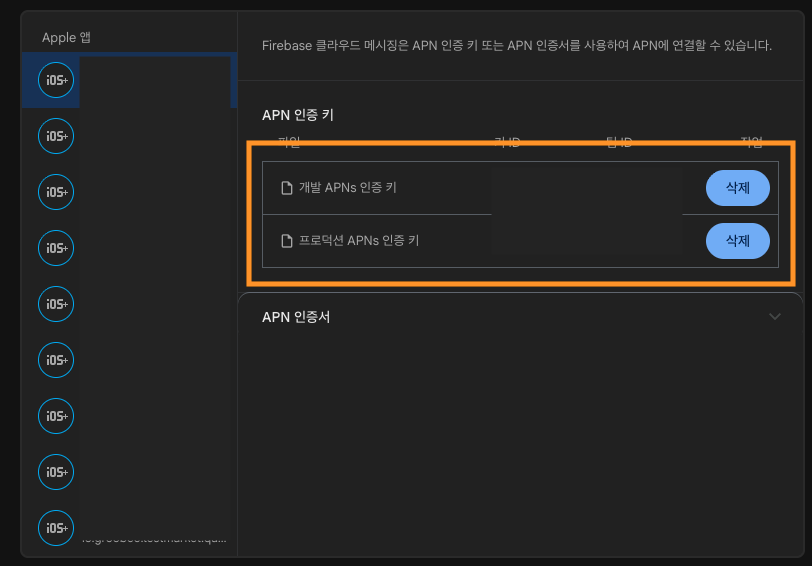

참고 링크:

- APNS 연동 공식 문서: [Firebase Cloud Messaging for iOS](https://firebase.google.com/docs/cloud-messaging/ios/client?hl=ko)
- Apple Auth Key 관리: [Apple Developer Auth Keys](https://developer.apple.com/account/resources/authkeys/list)
- Apple Team 정보: [Apple Developer Account](https://developer.apple.com/account)

<a id="ios-fcm-groobee-message-linkage"></a>
### FCM과 GroobeeKit 간 메시지 연동

아래 예시는 현재 권장 SDK 기준입니다. v.1.1.5 이상에서는 `UNNotificationResponse`를 SDK에 전달하면 일반 푸시 본체 탭과 알림 설정 액션 탭을 함께 처리할 수 있습니다.

알림 응답 처리는 `Groobee.getInstance().userNotificationCenter(response:)`에서 처리합니다. 이 메소드는 Groobee 푸시의 알림 본문 탭과 알림 설정 버튼 액션을 처리합니다. `GroobeeNotification.getInstance().receiveService()`는 아래 Rich Push 섹션의 `Notification Service Extension`에서 알림 표시 전 내용을 가공할 때 사용하는 메소드이며, 알림 응답 처리용이 아닙니다.

Swift:

```swift
extension AppDelegate: MessagingDelegate, UNUserNotificationCenterDelegate {
    func application(
        _ application: UIApplication,
        didRegisterForRemoteNotificationsWithDeviceToken deviceToken: Data
    ) {
        Messaging.messaging().apnsToken = deviceToken
    }

    func application(
        _ application: UIApplication,
        didReceiveRemoteNotification userInfo: [AnyHashable: Any],
        fetchCompletionHandler completionHandler: @escaping (UIBackgroundFetchResult) -> Void
    ) {
        Groobee.getInstance().didReceiveRemoteNotification(userInfo: userInfo)
        completionHandler(.newData)
    }

    func messaging(_ messaging: Messaging, didReceiveRegistrationToken fcmToken: String?) {
        let dataDict: [String: String] = ["token": fcmToken ?? ""]
        Groobee.getInstance().setPushToken(pushToken: fcmToken!)
        NotificationCenter.default.post(
            name: Notification.Name("FCMToken"),
            object: nil,
            userInfo: dataDict
        )
    }

    func userNotificationCenter(
        _ center: UNUserNotificationCenter,
        willPresent notification: UNNotification,
        withCompletionHandler completionHandler: @escaping (UNNotificationPresentationOptions) -> Void
    ) {
        completionHandler([.alert, .badge, .sound])
    }

    func userNotificationCenter(
        _ center: UNUserNotificationCenter,
        didReceive response: UNNotificationResponse,
        withCompletionHandler completionHandler: @escaping () -> Void
    ) {
        if Groobee.getInstance().userNotificationCenter(response: response) {
            // SDK가 처리됨 (일반 푸시 본체 탭 / 알림 설정 액션 탭 모두 포함)
        } else {
            // 호스트 앱의 비-Groobee 푸시 처리 로직
        }

        completionHandler()
    }
}
```

Objective-C:

```objectivec
- (void)application:(UIApplication *)application
didRegisterForRemoteNotificationsWithDeviceToken:(NSData *)deviceToken {
    [FIRMessaging messaging].APNSToken = deviceToken;
}

- (void)application:(UIApplication *)application
didReceiveRemoteNotification:(NSDictionary *)userInfo
fetchCompletionHandler:(void (^)(UIBackgroundFetchResult))completionHandler {
    [[Groobee getInstance] didReceiveRemoteNotificationWithUserInfo:userInfo];
    completionHandler(UIBackgroundFetchResultNewData);
}

- (void)messaging:(FIRMessaging *)messaging didReceiveRegistrationToken:(NSString *)fcmToken {
    NSDictionary *dataDict = [NSDictionary dictionaryWithObject:fcmToken forKey:@"token"];
    [[NSNotificationCenter defaultCenter] postNotificationName:@"FCMToken" object:nil userInfo:dataDict];
    [[Groobee getInstance] setPushTokenWithPushToken:fcmToken];
}

- (void)userNotificationCenter:(UNUserNotificationCenter *)center
       willPresentNotification:(UNNotification *)notification
         withCompletionHandler:(void (^)(UNNotificationPresentationOptions))completionHandler {
    completionHandler(
        UNNotificationPresentationOptionAlert |
        UNNotificationPresentationOptionBadge |
        UNNotificationPresentationOptionSound
    );
}

- (void)userNotificationCenter:(UNUserNotificationCenter *)center
didReceiveNotificationResponse:(UNNotificationResponse *)response
         withCompletionHandler:(void (^)(void))completionHandler {
    if ([[Groobee getInstance] userNotificationCenterWithResponse:response]) {
        // SDK가 처리됨 (일반 푸시 본체 탭 / 알림 설정 액션 탭 모두 포함)
    } else {
        // 호스트 앱의 비-Groobee 푸시 처리 로직
    }

    completionHandler();
}
```

<details markdown="1">
<summary>v.1.1.5 미만 SDK 사용 시</summary>

v.1.1.5 미만 SDK를 사용 중이라면 위 `didReceive` 메소드 대신 아래 코드를 사용하세요. `setNotificationSettingsButton` 액션 처리는 v.1.1.5 이상에서 지원됩니다.

Swift:

```swift
func userNotificationCenter(
    _ center: UNUserNotificationCenter,
    didReceive response: UNNotificationResponse,
    withCompletionHandler completionHandler: @escaping () -> Void
) {
    let notification = response.notification
    let userInfo = notification.request.content.userInfo

    switch response.actionIdentifier {
    case UNNotificationDefaultActionIdentifier:
        Groobee.getInstance().userNotificationCenter(userInfo: userInfo)
    default:
        print("nil")
    }

    completionHandler()
}
```

Objective-C:

```objectivec
- (void)userNotificationCenter:(UNUserNotificationCenter *)center
didReceiveNotificationResponse:(UNNotificationResponse *)response
         withCompletionHandler:(void (^)(void))completionHandler {
    NSDictionary *userInfo = response.notification.request.content.userInfo;
    if ([response.actionIdentifier isEqualToString:@"com.apple.UNNotificationDefaultActionIdentifier"]) {
        [[Groobee getInstance] userNotificationCenterWithUserInfo:userInfo];
    }
    completionHandler();
}
```

</details>

메소드별 역할은 다음과 같습니다.

| 위치 | 메소드 | 역할 |
| --- | --- | --- |
| `AppDelegate` | `Groobee.getInstance().didReceiveRemoteNotification(userInfo:)` | 푸시 수신 이벤트를 Groobee에 전달합니다. |
| `AppDelegate` | `Groobee.getInstance().userNotificationCenter(response:)` | 알림 본문 탭과 알림 설정 버튼 액션 등 Groobee 푸시 응답을 처리합니다. |
| `Notification Service Extension` | `GroobeeNotification.getInstance().receiveService(...)` | Rich Push 이미지 첨부, 알림 카테고리 설정 등 표시 전 가공을 처리합니다. |
| `Notification Content Extension` | `GroobeeNotification.getInstance().receiveContent(...)` | 커스텀 알림 UI 표시를 처리합니다. |

---

<a id="rich-push"></a>
## Rich Push 설정

Service와 Content Extension은 기본 푸시 수신, 푸시 오픈/응답 처리, 푸시 토큰 등록에는 필수가 아닙니다.

일반 텍스트 푸시 수신과 푸시 본문 탭 응답 처리는 위 AppDelegate 연동만으로 처리할 수 있습니다. 알림 설정 버튼 액션 응답도 `userNotificationCenter(response:)`에서 처리하지만, 버튼을 실제 알림에 표시하려면 알림 카테고리가 적용되어야 합니다. `Notification Service Extension`을 추가하면 `receiveService()`가 알림 표시 전에 카테고리와 첨부 파일을 가공합니다.

Service와 Content를 추가한 Rich Push 방식을 사용하면 푸시 메시지 전환 상태 측정과 커스텀 푸시 메시지 확장이 가능합니다.

### Notification Service Extension

사용자에게 전달되기 전 Remote Notification의 내용을 수정하는 확장입니다. 이미지, 비디오, 오디오, 특별한 형식의 콘텐츠를 알림에 추가하거나, 알림 메시지를 동적으로 생성하여 사용자에게 더 풍부한 정보를 제공할 수 있습니다.

`Notification Service Extension`은 이미지 첨부나 알림 표시 전 가공이 필요한 경우에만 추가합니다. 사용하지 않으면 일반 텍스트 푸시 수신/응답 처리는 가능하지만, 이미지가 포함된 Rich Push나 알림 표시 전 카테고리 설정은 처리되지 않습니다.

### Notification Content Extension

앱의 알림에 대한 사용자 지정 인터페이스를 표시하는 확장입니다. 사용자 지정 색상, 브랜딩, 미디어, 동적 콘텐츠를 알림 인터페이스에 통합할 수 있습니다.

`Notification Content Extension`은 커스텀 알림 UI가 필요한 경우에만 추가합니다.

참고 링크:

- [UNNotificationServiceExtension](https://developer.apple.com/documentation/usernotifications/unnotificationserviceextension)
- [UNNotificationContentExtension](https://developer.apple.com/documentation/usernotificationsui/unnotificationcontentextension)

### Service 설정 예시

1. `+ Capabilities` 버튼을 눌러 `Push Notifications`와 `Background Modes`를 추가하고, `Background fetch`와 `Remote notifications`를 체크하여 활성화합니다.

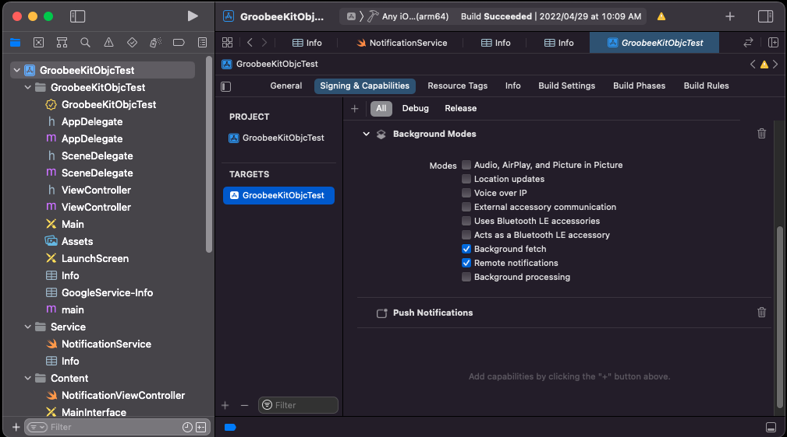

2. `TARGETS` 하단의 `+` 버튼을 클릭합니다.

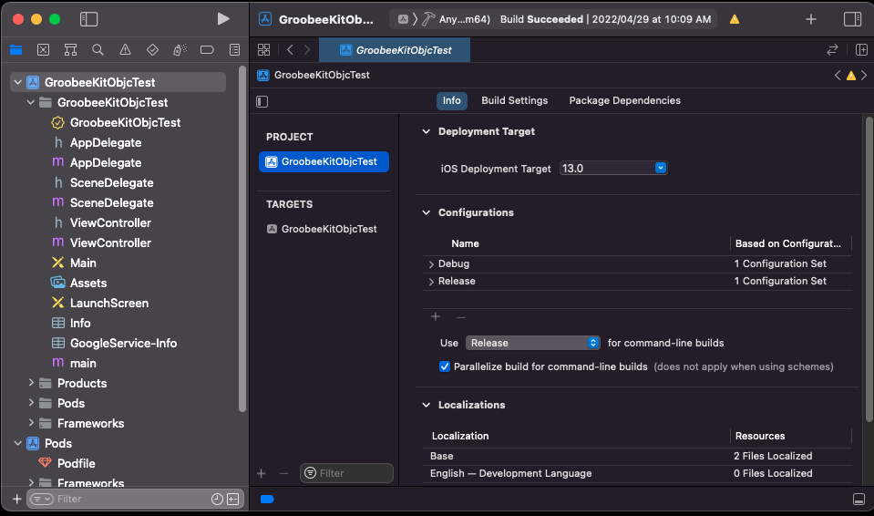

3. `Notification` 검색 후 `Notification Service Extension`을 선택하여 `Next`로 진행합니다.

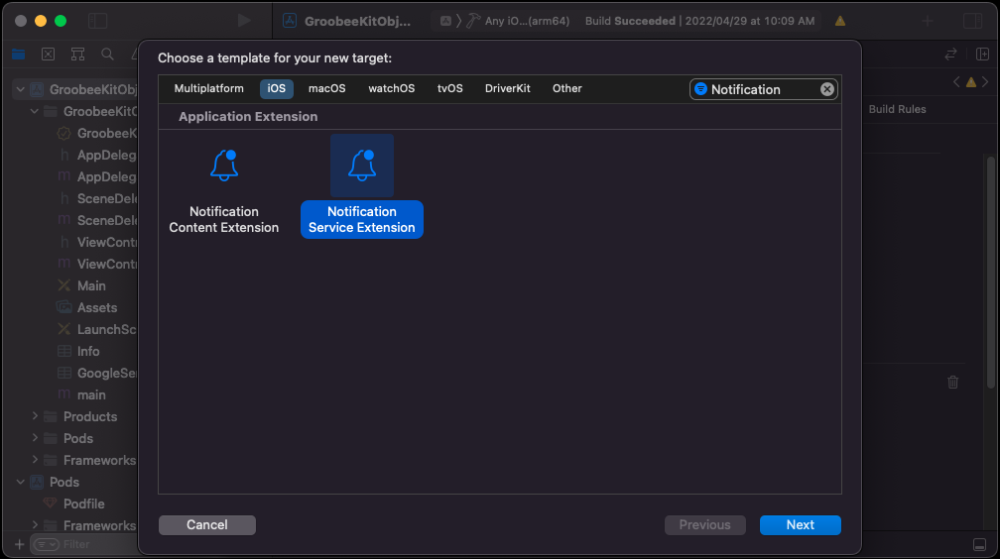

4. `Product Name`을 `Service`로 설정하고 `Language`를 `Swift`로 선택한 뒤 `Finish`를 클릭합니다. 이어서 `Activate`를 눌러 Service 스키마를 활성화합니다.

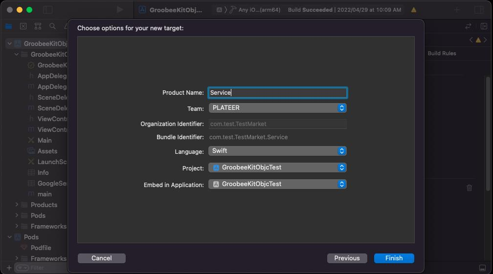

5. Service의 `Deployment Info`에서 iOS 버전을 현재 앱의 Deployment Target과 동일하게 맞추고, `Frameworks and Libraries`에 `GroobeeKit.xcframework`를 추가한 뒤 `Embed`를 `Do Not Embed`로 설정합니다.

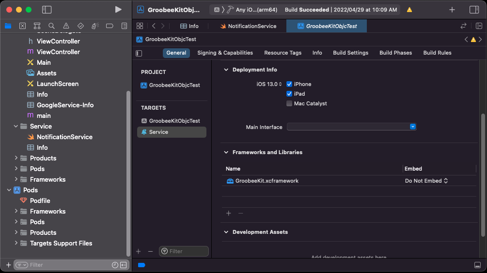

6. `Service -> Info.plist`에 아래 항목을 추가합니다.

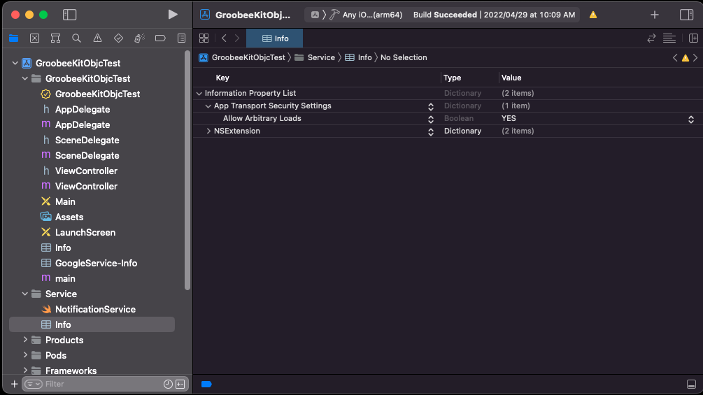

| Key | Type | Value |
| --- | --- | --- |
| `App Transport Security Settings` | Dictionary | `(1 item)` |
| `Allow Arbitrary Loads` | Boolean | `YES` |

7. `NotificationService.swift`에 아래 코드를 작성합니다.

Firebase 메시징 서비스가 이미 등록되어 있는 경우 `GroobeeNotification.getInstance().receiveService()`를 통해 `request`, `bestAttemptContent`, `contentHandler` 객체를 그루비에 전달할 수 있습니다.

또한 그루비는 Admin에서 발송한 메시지만 렌더링할 수 있도록 분기 처리 로직이 포함되어 있습니다. 다른 FCM 서비스를 이용 중인 경우에는 `else` 구간에 코드를 삽입해 메시징 핸들링을 제어할 수 있습니다.

```swift
import UserNotifications
import Foundation
import GroobeeKit

class NotificationService: UNNotificationServiceExtension {
    var contentHandler: ((UNNotificationContent) -> Void)?
    var bestAttemptContent: UNMutableNotificationContent?

    override func didReceive(
        _ request: UNNotificationRequest,
        withContentHandler contentHandler: @escaping (UNNotificationContent) -> Void
    ) {
        self.contentHandler = contentHandler
        bestAttemptContent = request.content.mutableCopy() as? UNMutableNotificationContent

        if let bestAttemptContent = bestAttemptContent {
            if GroobeeNotification.getInstance().receiveService(
                request,
                bestAttemptContent,
                withContentHandler: contentHandler
            ) {
                // Groobee Push Message
            } else {
                // Check if message contains a notification payload.
            }
        }
    }

    override func serviceExtensionTimeWillExpire() {
        if let contentHandler = contentHandler, let bestAttemptContent = bestAttemptContent {
            contentHandler(bestAttemptContent)
        }
    }
}
```

### Content 설정 예시

1. `TARGETS` 하단의 `+` 버튼을 클릭합니다.

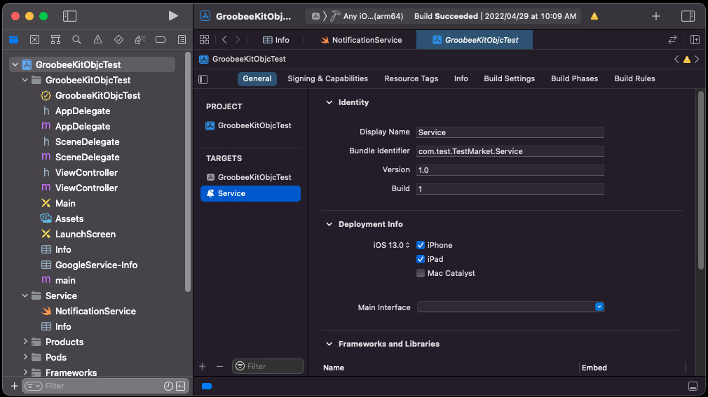

2. `Notification` 검색 후 `Notification Content Extension`을 선택하여 `Next`로 진행합니다.

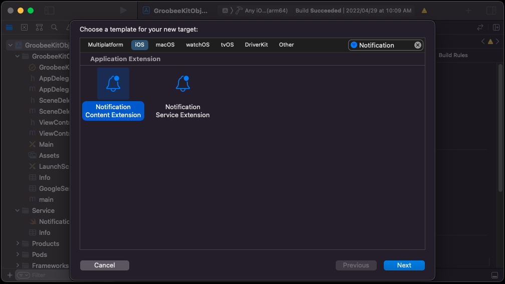

3. `Product Name`을 `Content`로 설정하고 `Language`를 `Swift`로 선택한 뒤 `Finish`를 클릭합니다. 이어서 `Activate`를 눌러 Content 스키마를 활성화합니다.

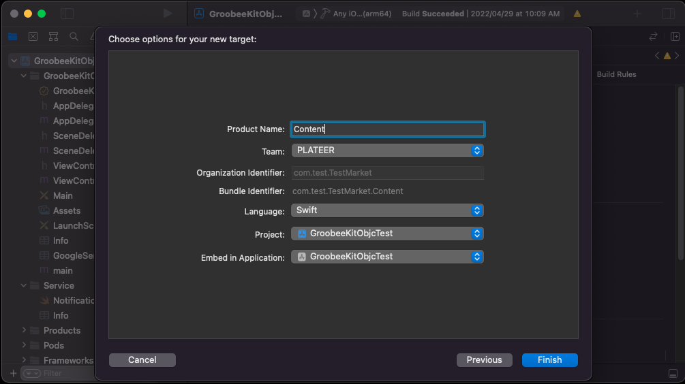

4. Content의 `Deployment Info`에서 iOS 버전을 현재 앱의 Deployment Target과 동일하게 맞추고, `Frameworks and Libraries`에 `GroobeeKit.xcframework`를 추가한 뒤 `Embed`를 `Do Not Embed`로 설정합니다.

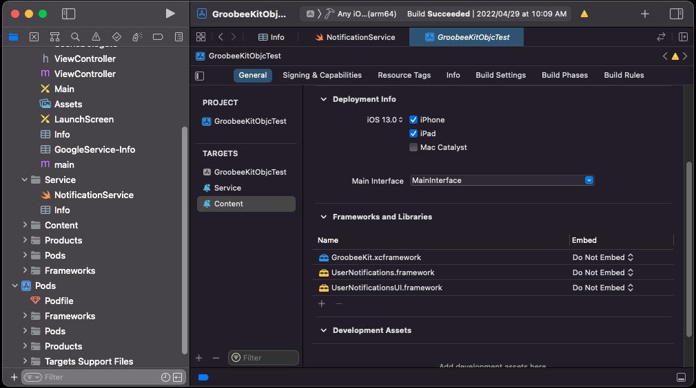

5. `Content -> Info.plist`에 아래 항목을 추가합니다.

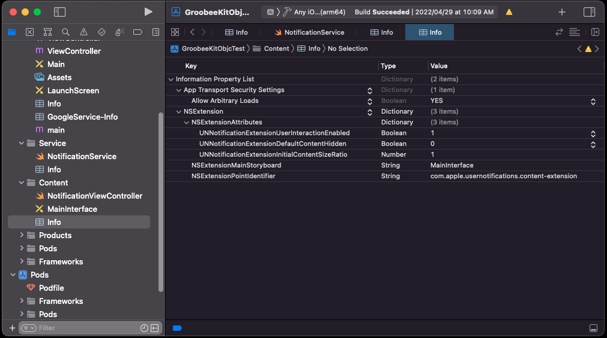

Content Info.plist:

| Key | Type | Value |
| --- | --- | --- |
| `App Transport Security Settings` | Dictionary | `(1 item)` |
| `Allow Arbitrary Loads` | Boolean | `YES` |

| Key | Type | Value |
| --- | --- | --- |
| `NSExtensionAttributes` | Dictionary | `(3 item)` |
| `UNNotificationExtensionUserInteractionEnabled` | Boolean | `1` |
| `UNNotificationExtensionDefaultContentHidden` | Boolean | `0` |
| `UNNotificationExtensionInitialContentSizeRatio` | Number | `1` |

6. `NotificationViewController.swift`에 아래 코드를 작성합니다.

Firebase 메시징 서비스가 이미 등록되어 있는 경우 `GroobeeNotification.getInstance().receiveContent()`를 통해 `notification` 객체를 그루비에 전달할 수 있습니다.

`NotificationService.swift`에 추가한 분기 로직과 동일하게 Content에도 분기 코드를 작성합니다.

```swift
import UIKit
import UserNotifications
import UserNotificationsUI
import Foundation
import GroobeeKit

class NotificationViewController: UIViewController, UNNotificationContentExtension {
    @IBOutlet var label: UILabel?

    func didReceive(_ notification: UNNotification) {
        if GroobeeNotification.getInstance().receiveContent(notification) {
            // Groobee Push Message
        } else {
            // Check if message contains a notification payload.
        }
    }

    func didReceive(
        _ response: UNNotificationResponse,
        completionHandler completion: @escaping (UNNotificationContentExtensionResponseOption) -> Void
    ) {
        completion(.doNotDismiss)
    }
}
```

---

<a id="sdk-methods"></a>
## 설치 후 연동 문서

### 개요 및 지원 범위

- [iOS SDK 개요 및 지원 범위](../detail/ios-sdk-overview.md)

### 회원 정보 및 푸시 상태

- [iOS SDK 회원 정보 및 푸시 상태 연동](../detail/ios-sdk-member-push.md)

### 행동 이력 수집

- [iOS SDK 행동 이력 수집](../detail/ios-sdk-actions.md)

### 하이브리드 앱 데이터 동기화

- [iOS SDK 하이브리드 앱 데이터 동기화](../detail/ios-sdk-hybrid-sync.md)

### 추천 상품 연동

- [iOS SDK 추천 상품 연동](../detail/ios-sdk-recommend.md)

### 주의사항 및 로그 유틸리티

- [iOS SDK 주의사항 및 로그 유틸리티](../detail/ios-sdk-cautions-log.md)
