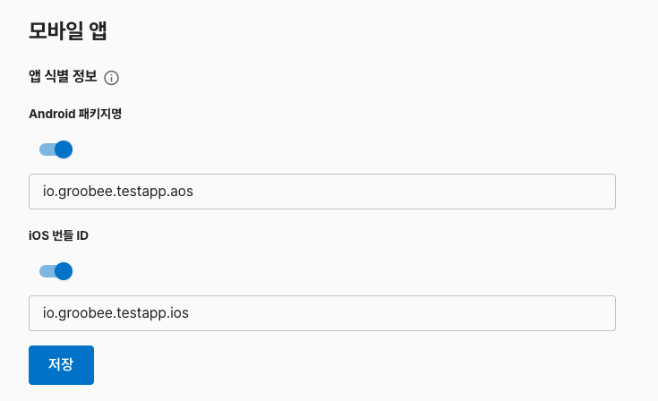
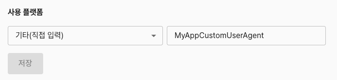

# 앱 정보 등록

앱에서 Groobee 기능을 사용하기 위해서는
**앱 패키지명 혹은 앱 Bundle ID를 Groobee 어드민 사이트에 등록해야 합니다.**

앱 패키지명이 등록되지 않은 경우,
SDK가 정상적으로 설치되어 있어도 **데이터 수집이 이루어지지 않습니다.**

하이브리드 앱의 경우, 웹뷰 안에서 실행되는 Groobee 웹 스크립트 트래픽을 앱 트래픽으로 구분하기 위해 **사용 플랫폼(커스텀 User-Agent)** 도 함께 등록해야 합니다.

---

## 앱 패키지명 / Bundle ID 등록

### 언제 필요한가

아래에 해당하는 경우 앱 패키지명 등록이 필요합니다.

- 앱에 Groobee SDK를 처음 연동하는 경우
- 앱 패키지명 혹은 앱 Bundle ID가 변경된 경우

### 등록 방법

아래 예시는 신규 어드민 화면에서 앱 패키지명을 등록하는 방법입니다.

1. Groobee 어드민 사이트에 로그인합니다.
2. **설정 > 모바일 앱** 메뉴로 이동합니다.
3. 서비스를 사용할 **앱 패키지명 혹은 앱 Bundle ID**를 앱 식별 정보란에 입력합니다.  
아래는 앱 패키지명 등록 예시입니다.

>  - Android 패키지명: Google Play 스토어에 등록된 앱 패키지명을 입력해 주세요.  
> - iOS 번들 ID: App Store에 등록된 앱 번들 ID를 입력해 주세요. 

4. 저장 버튼을 클릭하여 설정을 완료합니다.

### 주의 사항

- 하이브리드 앱의 경우에도 푸시 등 SDK의 기능이 사용되므로 앱 이름 등록이 필요합니다.

---

## 사용 플랫폼 설정 (하이브리드 앱에서 앱 여부 식별)

하이브리드 앱은 웹뷰에 로드된 페이지에서 Groobee **웹 스크립트**가 함께 실행됩니다.
이 때 Groobee 서버에 들어오는 요청이 **웹 브라우저에서 발생한 것인지, 앱 내부 웹뷰에서 발생한 것인지**를 구분할 수 있어야 사용자/세션이 정확하게 집계됩니다.

그루비는 이를 웹뷰의 **User-Agent 문자열**로 구분합니다. 앱에서 웹뷰에 커스텀 User-Agent 값을 지정한 뒤, Groobee 어드민의 `사용 플랫폼` 항목에도 같은 값을 등록해두면, 해당 User-Agent로 들어오는 요청이 "앱 내부 웹뷰 트래픽"으로 식별됩니다.

### 언제 필요한가

- 앱이 웹뷰로 웹 페이지를 로드하고, 해당 페이지에 Groobee 웹 스크립트가 설치되어 있는 경우 (하이브리드 앱)
- 앱 웹뷰 트래픽과 일반 웹 브라우저 트래픽을 어드민에서 구분해 보고 싶은 경우

> 네이티브 앱(웹뷰 없이 SDK만 사용하는 앱)에서는 이 설정이 필요하지 않습니다.

### 등록 방법

1. Groobee 어드민 사이트에서 **설정 > 모바일 앱 > 사용 플랫폼** 메뉴로 이동합니다.
2. 드롭다운에서 `기타(직접 입력)`을 선택하고, 오른쪽 입력란에 앱 웹뷰가 사용하는 **커스텀 User-Agent 식별자**를 입력합니다.
3. 저장 버튼을 클릭합니다.

> 위 예시처럼 `MyAppCustomUserAgent`를 등록했다면, 앱의 웹뷰에도 User-Agent에 동일 문자열이 포함되도록 설정해야 합니다.
> 각 플랫폼(Android `WebView`, iOS `WKWebView`, Flutter `webview_flutter`)에서 웹뷰 User-Agent에 커스텀 값을 설정하는 방법은 [부록: 웹뷰 커스텀 User-Agent 설정](../appendix/webview-custom-user-agent.md)을 참고하세요.

### 주의 사항

- 어드민에 등록된 User-Agent 식별자와 앱 웹뷰가 실제로 전송하는 User-Agent 문자열이 **완전히 일치**해야 합니다. 오타/대소문자 차이가 있으면 앱 트래픽으로 집계되지 않습니다.

---

## 등록 후 확인 사항

앱 패키지명 등록, SDK가 설치된 후에는 아래 사항을 확인해주세요.

- Groobee 어드민 사이트 실시간 모니터링 메뉴에서 모바일 앱 데이터가 수집되는지

문제가 발생하는 경우  
👉 [트러블슈팅 문서](../troubleshooting/README.md)를 참고하거나  
👉 GitHub Issues로 문의해주세요.
