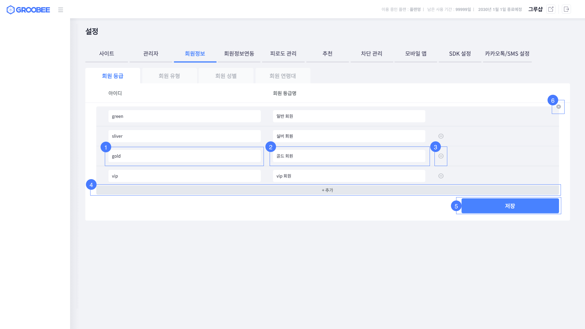
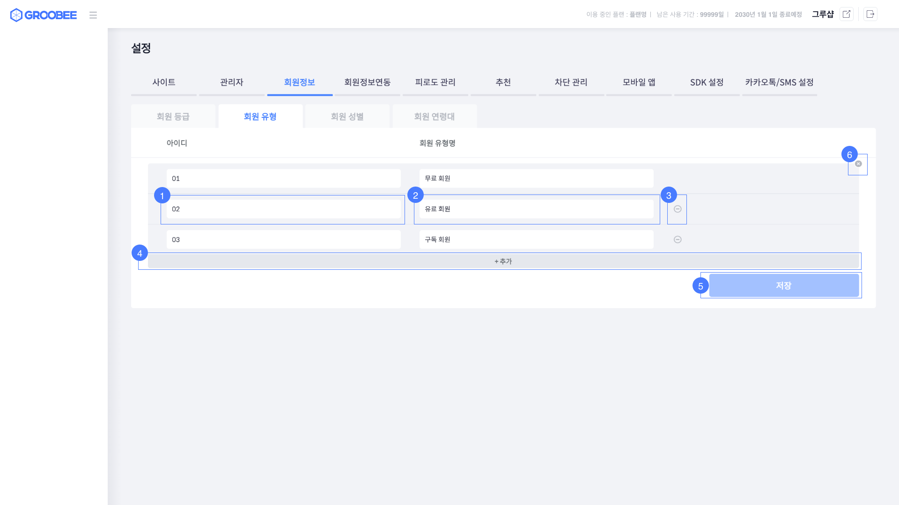
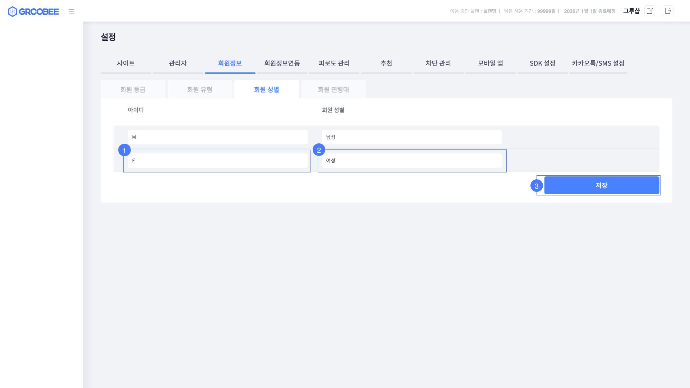
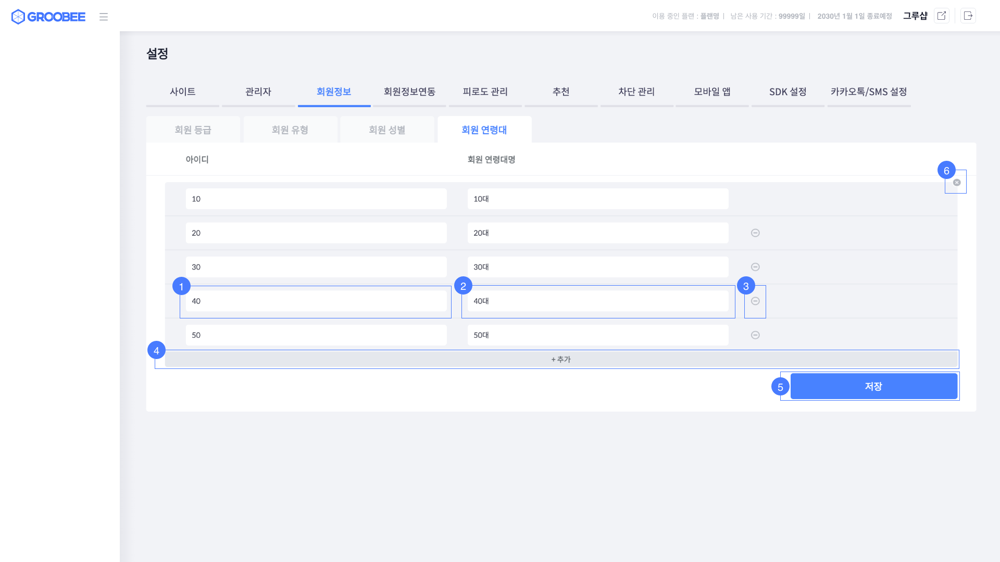

# 회원 정보 설정

Groobee에서 회원 정보에 따른 맞춤 캠페인을 사용하기기 위해서는 Groobee 관리자 사이트에서 회원정보를 설정해줘야 합니다.
> 회원 정보 설정을 하지 않은 경우 캠페인 등록 시 해당 조건을 사용할 수 없습니다.

Groobee에서 기본적으로 지원하는 회원정보 유형은 회원 등급, 회원 유형, 회원 성별, 회원 연령대가 있으며, 
**Groobee 관리자 사이트 -> 설정 -> 회원정보**에서 각각 설정할 수 있습니다. 

## 회원 정보 설정 예시

### 회원 등급 설정 예시

### 회원 유형 설정 예시

### 회원 성별 설정 예시

### 회원 연령대 설정 예시

