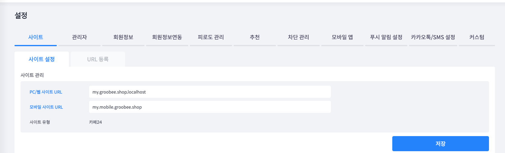

# 웹 도메인 등록

웹 환경에서 Groobee 스크립트를 사용하기 위해서는  
**서비스 도메인을 Groobee 어드민 사이트에 사전에 등록해야 합니다.**

도메인이 등록되지 않은 경우,  
스크립트가 정상적으로 삽입되어 있어도 **데이터 수집이 이루어지지 않습니다.**

---

## 언제 필요한가

아래에 해당하는 경우 도메인 등록이 필요합니다.

- 신규 웹 사이트에 Groobee 스크립트를 처음 연동하는 경우
- 운영 도메인이 변경된 경우

---

## 등록 방법

1. Groobee 어드민 사이트에 로그인합니다.
2. **설정 > 사이트 > 사이트 설정** 메뉴로 이동합니다.
3. 서비스에 사용할 **사이트 도메인**을 입력합니다.

4. 저장 버튼을 클릭하여 설정을 완료합니다.

---

## 주의 사항

- 프로토콜(`http://`, `https://`)은 입력하지 않습니다.
- 웹, 모바일 사이트 도메인이 동일하더라도 PC/웹사이트 URL란과 모바일 사이트 URL란에 각각 등록해야 합니다.
- 여러 도메인을 사용하는 경우 모두 등록해야 하며 각 도메인은 ,(콤마)로 구분하여 입력합니다.
    - 예: shop1.example.com,shop2.example.com,localhost
- 하이브리드 앱의 경우도 스크립트를 활용하기 떄문에 사용하는 도메인이 따로 있을 경우도 등록해줘야 합니다.

---

## 등록 후 확인 사항

도메인 등록, 스크립트가 설치된 후에는 아래 사항을 확인해주세요.

- 웹 페이지 접속 시 브라우저 콘솔에 오류가 발생하지 않는지
- Groobee 어드민 사이트에서 실시간 데이터가 수집되는지

문제가 발생하는 경우  
👉 [트러블슈팅 문서](../troubleshooting/README.md)를 참고하거나  
👉 GitHub Issues로 문의해주세요.