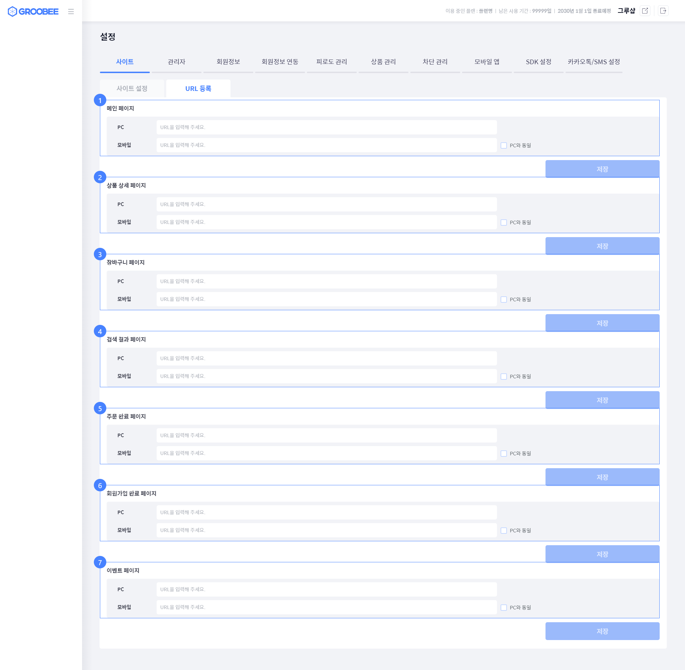

# 웹 페이지 URL 등록

Groobee 스크립트에서 행동 이력을 수집하기 위해서는  
**각 페이지의 URL을 Groobee 어드민 사이트에 등록해야 합니다.** 

여기서 등록된 URL은 [행동 이력 수집](../installation/installation-web-action.md)시에 사용되며,  
사이트 유형에 따라 URL이 등록되지 않은 경우, **행동 이력이 정상적으로 수집되지 않을 수 있습니다.**

> 커스텀 SPA를 제외한 모든 유형의 사이트에서는 사용하고 있는 모든 유형의 페이지 URL 등록이 필수입니다.

> 커스텀 SPA의 경우 메인페이지와 회원가입완료 페이지 URL은 등록이 필수이며,  
> 나머지 페이지 URL은 필수는 아니나 등록이 권장됩니다. 

---

## 등록 방법

1. Groobee 어드민 사이트에 로그인합니다.
2. **설정 > 사이트 > URL 등록** 메뉴로 이동합니다.
3. 각 유형 페이지 URL 들을 작성하고 저장합니다.

4. 작성이 완료됐으면, 저장 버튼을 클릭하여 설정을 완료합니다.

---

## 등록 시 참고 사항

- 페이지 URL 설정시에는 도메인은 입력하지 않습니다.  
  - 예: 상품 상세 페이지 경로가 도메인을 포함해 **https://www.example.com/detail** 인 경우, `/detail` 만 입력합니다.
- 메인 페이지 URL 첫번째 값은 온사이트 캠페인 미리보기에서 사용되므로, 도메인을 포함한 전체 URL을 입력합니다.  
  - 예: www.groobee.io/main
- 하나의 페이지 유형에 여러 URL이 존재하는 경우, 콤마(`,`)로 구분하여 여러 URL을 등록할 수 있습니다.  
  - 예: 상품 상세 페이지 경로가 `/goods`, `/products` 두 가지인 경우, `/goods,/product` 으로 입력합니다.
- PC와 모바일의 경로가 동일하더라도 각각 등록해야 합니다.
- URL은 포함 매칭 방식으로 동작합니다.  
  - 예: `/product` 로 등록된 경우, `/product/123`, `/product/view` 등도 동일한 페이지 유형으로 인식됩니다.
- URL 등록 시 대소문자를 구분합니다.

---

## 등록 후 확인 사항

페이지 URL 등록 및 스크립트가 설치된 후에는 아래 사항을 확인해주세요.

- 각 페이지 접속 시 브라우저 콘솔에 오류가 발생하지 않는지
- Groobee로 전송되는 행동이력 수집 네트워크 패킷의 actionCd가 유형에 맞게 정상적으로 전송되는지
- Groobee 어드민 사이트에서 페이지 유형에 맞게 실시간 데이터가 수집되는지

문제가 발생하는 경우  
👉 [트러블슈팅 문서](../troubleshooting/README.md)를 참고하거나  
👉 GitHub Issues로 문의해주세요.