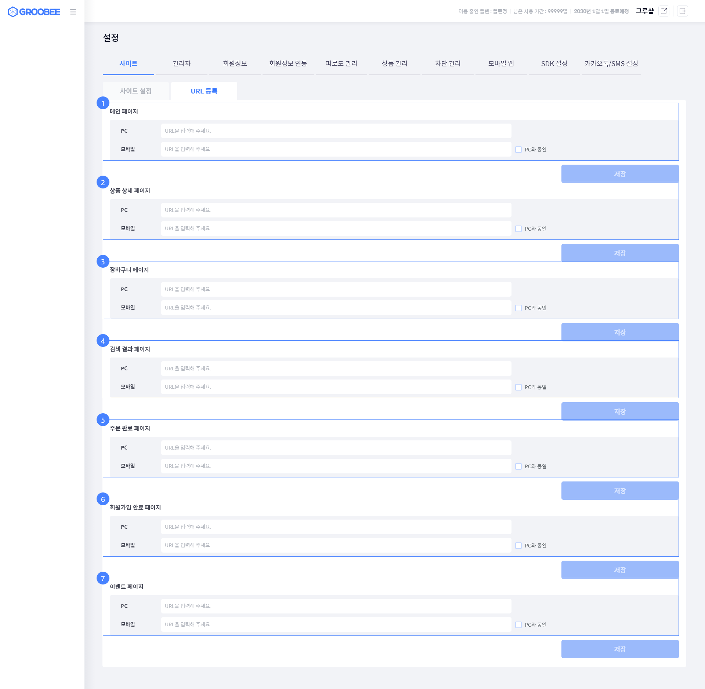

# 웹 페이지 URL 등록

Groobee 스크립트에서 행동 이력을 수집하기 위해서는  
**각 페이지의 URL을 Groobee 어드민 사이트에 등록해야 합니다.** 

여기서 등록된 URL은 [행동 이력 수집](../installation/installation-web-action.md)시에 사용되며,  
사이트 유형에 따라 URL이 등록되지 않은 경우, **행동 이력이 정상적으로 수집되지 않을 수 있습니다.**

> 커스텀 SPA를 제외한 모든 유형의 사이트에서는 사용하고 있는 모든 유형의 페이지 URL 등록이 필수입니다.

> 커스텀 SPA의 경우 메인페이지와 회원가입완료 페이지 URL은 등록이 필수이며,  
> 나머지 페이지 URL도 등록을 권장합니다.  
> 나머지 페이지 URL이 등록되지 않은 경우, 사용자가 해당 페이지로 사이트에 처음 진입(새로고침 포함)하면  
> 그 페이지에서 호출한 행동 이력(예: 상품상세 VG) 대신 기타 페이지(LO)로 수집될 수 있습니다. 

---

## 등록 방법

1. Groobee 어드민 사이트에 로그인합니다.
2. **설정 > 사이트 > URL 등록** 메뉴로 이동합니다.
3. 각 유형 페이지 URL 들을 작성하고 저장합니다.

4. 작성이 완료됐으면, 저장 버튼을 클릭하여 설정을 완료합니다.

---

## 등록 시 참고 사항

- 페이지 URL 설정시에는 도메인은 입력하지 않습니다.  
  - 예: 상품 상세 페이지 경로가 도메인을 포함해 **https://www.example.com/detail** 인 경우, `/detail` 만 입력합니다.
- 메인 페이지 URL 첫번째 값은 온사이트 캠페인 미리보기에서 사용되므로, 도메인을 포함한 전체 URL을 입력합니다.  
  - 예: www.groobee.io/main
  - 메인 페이지 판별 시 접속 URL의 `www.`는 제외하고 비교하므로, `www.`가 포함된 첫번째 값만으로는 메인 페이지로 인식되지 않을 수 있습니다.  
    첫번째 값 뒤에 도메인을 제외한 경로도 함께 등록해주세요.
    - 예: `www.groobee.io/main,/main` (메인 경로가 도메인 루트인 경우 `www.groobee.io,/`)
- 하나의 페이지 유형에 여러 URL이 존재하는 경우, 콤마(`,`)로 구분하여 여러 URL을 등록할 수 있습니다.  
  - 예: 상품 상세 페이지 경로가 `/goods`, `/products` 두 가지인 경우, `/goods,/products` 으로 입력합니다.
- PC와 모바일의 경로가 동일하더라도 각각 등록해야 합니다.
- 페이지 유형에 따라 URL 매칭 방식이 다릅니다.

| 페이지 유형 | 매칭 방식 | 대소문자 | 예시 |
|---|---|---|---|
| 메인 페이지 | 완전 일치 | 구분 | `/main` 등록 시 `/main` 은 인식 / `/main/event`, `/main?ref=a` 는 인식하지 않음 쿼리스트링이 붙는 경우까지 인식하려면 `www.` 를 제외한 도메인 포함 값(`groobee.io/main`)을 함께 등록 |
| 상품 상세 페이지 | 포함 매칭 (등록값의 쿼리스트링은 무시) | 구분하지 않음 | `/product/detail` 등록 시 `/Product/Detail?no=1` 도 인식 |
| 그 외 페이지 (검색, 장바구니, 주문서, 주문완료, 카테고리, 회원가입완료 등) | 포함 매칭 | 구분 | `/cart` 등록 시 `/cart`, `/cart/list` 모두 인식 |

- 메인 페이지 URL에 경로 값이 달라지는 구간이 있다면 `[이름]` 형식으로 등록할 수 있습니다.  
  - 예: `/[lang]/main` 등록 시 `/ko/main`, `/en/main` 모두 메인 페이지로 인식 (이 형식은 경로만 비교하며 쿼리스트링은 무시합니다.)

---

## 등록 후 확인 사항

페이지 URL 등록 및 스크립트가 설치된 후에는 아래 사항을 확인해주세요.

- 각 페이지 접속 시 브라우저 콘솔에 오류가 발생하지 않는지
- Groobee로 전송되는 행동이력 수집 네트워크 패킷의 actionCd가 유형에 맞게 정상적으로 전송되는지
- Groobee 어드민 사이트에서 페이지 유형에 맞게 실시간 데이터가 수집되는지

문제가 발생하는 경우  
👉 [트러블슈팅 문서](../troubleshooting/README.md)를 참고하거나  
👉 GitHub Issues로 문의해주세요.